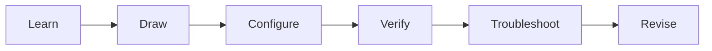

# Student Dashboard

> [!abstract]
> Follow one clear cycle: learn the idea, observe it, configure it, verify it, break it safely, and revise it.

## Your Study Cycle

## Start by Experience

### New to networking

1. [[Fundamentals Guide]]
2. [[Addressing and Subnetting Guide]]
3. [[Switching and VLANs Guide]]
4. [[Routing Guide]]

### Know the basics

1. [[Network Services Guide]]
2. [[Security Guide]]
3. [[High Availability Guide]]
4. [[Monitoring and Management Guide]]

### Preparing for practical assessment

1. Choose a topic in [[Learn Dashboard]].
2. Complete its numbered exercise in [[Lab Dashboard]].
3. Use [[Viva Questions Guide]].
4. Finish with [[Lab 30 - Network Troubleshooting Challenge]].

## Progress Checklist

- [ ] I can explain the purpose without commands.
- [ ] I can draw the traffic or protocol sequence.
- [ ] I can configure each device separately.
- [ ] I can prove it works with show commands and endpoint tests.
- [ ] I can diagnose one realistic fault.
