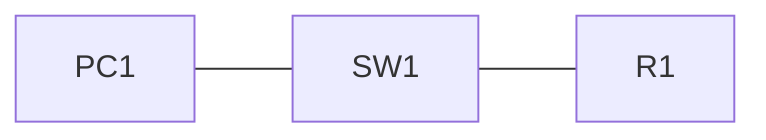

# 01 - Cisco Router Basic Configuration - Step by Step

> [!info] Outcome
> Configure a router hostname, secure local access, IPv4 interfaces, Secure Shell (SSH), and saved startup configuration.

> [!warning] Interface-name check
> The examples use Cisco 2911/1941 router interfaces such as `GigabitEthernet0/0` and Cisco 2960 switch ports such as `FastEthernet0/1`. Check the labels on your Packet Tracer device and substitute the actual interface name when it differs.

## 1. Packet Tracer Support

**Yes**

## 2. Example Topology



### Devices and Cabling

| From | To | Cable / Link |
|---|---|---|
| PC1 FastEthernet0 | SW1 FastEthernet0/1 | Copper straight-through |
| SW1 GigabitEthernet0/1 | R1 GigabitEthernet0/0 | Copper straight-through |

## 3. Addressing Plan

| Device | Interface | Address / Setting | Default Gateway |
|---|---|---|---|
| R1 | G0/0 | 192.168.10.1 /24 | — |
| PC1 | FastEthernet0 | 192.168.10.10 /24 | 192.168.10.1 |

## 4. Before You Configure

1. Place and rename every device exactly as shown.
2. Connect the interfaces in the cabling table.
3. Wait for links to become active before troubleshooting Layer 3.
4. Erase or inspect old lab configuration so it does not conflict with this example.

## 5. Step-by-Step Configuration

### Step 1 — Build the topology

Place the listed devices, rename them, and make each connection shown above.

### Step 2 — Confirm the addressing plan

Check that every address is unique, belongs to the stated subnet, and uses the correct mask or prefix length.

### Step 3 — Open each device

For IOS devices, select **CLI** and press Enter. For PCs and servers, use the named Packet Tracer desktop or services panel.

### Step 4 — Configure R1

Open **R1 → CLI**, press Enter, and enter the following commands exactly.

```cisco
enable
configure terminal
hostname R1
no ip domain-lookup
enable secret ClassEnable!23
service password-encryption
banner motd #Authorised users only#
username admin privilege 15 secret AdminSSH!23
ip domain-name campus.lab
interface gigabitEthernet0/0
 description LAN_TO_SW1
 ip address 192.168.10.1 255.255.255.0
 no shutdown
 exit
crypto key generate rsa modulus 1024
ip ssh version 2
line console 0
 password Console!23
 login
 logging synchronous
 exec-timeout 10 0
 exit
line vty 0 4
 login local
 transport input ssh
 exec-timeout 10 0
end
copy running-config startup-config
```

### Step 5 — Configure PC1

Open **PC1 → Desktop → IP Configuration**. Enter IP `192.168.10.10`, mask `255.255.255.0`, and gateway `192.168.10.1`.

## 6. Complete Device Configurations

Use these blocks when rebuilding the example from an empty Packet Tracer file. Each block belongs only to the device named above it.

### R1

```cisco
enable
configure terminal
hostname R1
no ip domain-lookup
enable secret ClassEnable!23
service password-encryption
banner motd #Authorised users only#
username admin privilege 15 secret AdminSSH!23
ip domain-name campus.lab
interface gigabitEthernet0/0
 description LAN_TO_SW1
 ip address 192.168.10.1 255.255.255.0
 no shutdown
 exit
crypto key generate rsa modulus 1024
ip ssh version 2
line console 0
 password Console!23
 login
 logging synchronous
 exec-timeout 10 0
 exit
line vty 0 4
 login local
 transport input ssh
 exec-timeout 10 0
end
copy running-config startup-config
```

## 7. Key Configuration Logic

- Configure physical or logical interfaces before depending on a protocol that uses them.
- Use `no shutdown` on routed interfaces and switched virtual interfaces when required.
- Keep VLAN IDs, IP networks, masks, wildcard masks, and default gateways consistent with the addressing table.
- Save the configuration only after verification succeeds.

> [!note] Teaching note
> Packet Tracer may offer only a 1024-bit RSA key on some router images. Use 2048 bits on modern real equipment when supported.

## 8. Verification Commands

Run the commands relevant to the device and compare the result with the addressing and topology tables.

- `show ip interface brief`
- `show running-config`
- `show ip ssh`
- `show users`

## 9. Testing Matrix

| Test | Source | Destination / Check | Expected Result |
|---|---|---|---|
| Gateway ping | PC1 | 192.168.10.1 | Success |
| SSH login | PC1 | ssh -l admin 192.168.10.1 | Password prompt and R1 CLI |

## 10. Troubleshooting

| Symptom | Likely Cause | Check or Fix |
|---|---|---|
| G0/0 is administratively down | Missing no shutdown | Enter interface mode and use no shutdown |
| SSH fails | Hostname, domain name, key, or VTY login missing | Check show ip ssh and the VTY configuration |

## 11. Save and Finish

On every IOS device whose tests pass:

```cisco
copy running-config startup-config
```

Then save the Packet Tracer activity file with a descriptive version number.

## 12. Related Configuration Notes

- [[02 - Cisco Switch Basic Configuration - Step by Step]]
- [[03 - Cisco Multilayer Switch Basic Configuration - Step by Step]]
- [[04 - TFTP - Trivial File Transfer Protocol Backup and Restore - Step by Step]]

Return to [[Configuration Library Dashboard]].
