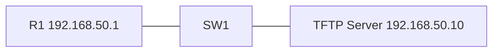

# 04 - TFTP - Trivial File Transfer Protocol Backup and Restore - Step by Step

> [!info] Outcome
> Back up a router running configuration to a Packet Tracer TFTP server and restore it safely.

> [!warning] Interface-name check
> The examples use Cisco 2911/1941 router interfaces such as `GigabitEthernet0/0` and Cisco 2960 switch ports such as `FastEthernet0/1`. Check the labels on your Packet Tracer device and substitute the actual interface name when it differs.

## 1. Packet Tracer Support

**Yes**

## 2. Example Topology



### Devices and Cabling

| From | To | Cable / Link |
|---|---|---|
| R1 G0/0 | SW1 G0/1 | Copper straight-through |
| Server FastEthernet0 | SW1 F0/1 | Copper straight-through |

## 3. Addressing Plan

| Device | Interface | Address / Setting | Default Gateway |
|---|---|---|---|
| R1 | G0/0 | 192.168.50.1 /24 | — |
| TFTP Server | FastEthernet0 | 192.168.50.10 /24 | 192.168.50.1 |

## 4. Before You Configure

1. Place and rename every device exactly as shown.
2. Connect the interfaces in the cabling table.
3. Wait for links to become active before troubleshooting Layer 3.
4. Erase or inspect old lab configuration so it does not conflict with this example.

## 5. Step-by-Step Configuration

### Step 1 — Build the topology

Place the listed devices, rename them, and make each connection shown above.

### Step 2 — Confirm the addressing plan

Check that every address is unique, belongs to the stated subnet, and uses the correct mask or prefix length.

### Step 3 — Open each device

For IOS devices, select **CLI** and press Enter. For PCs and servers, use the named Packet Tracer desktop or services panel.

### Step 4 — Configure R1 — Prepare and Back Up

Open **R1 — Prepare and Back Up → CLI**, press Enter, and enter the following commands exactly.

```cisco
enable
configure terminal
hostname R1
interface gigabitEthernet0/0
 ip address 192.168.50.1 255.255.255.0
 no shutdown
end
ping 192.168.50.10
copy running-config startup-config
copy running-config tftp:
192.168.50.10
R1-running-config
```
### Step 5 — Configure R1 — Restore

Open **R1 — Restore → CLI**, press Enter, and enter the following commands exactly.

```cisco
enable
copy tftp: running-config
192.168.50.10
R1-running-config
show running-config
copy running-config startup-config
```

### Step 6 — Configure the TFTP server

Open **Server → Desktop → IP Configuration** and set `192.168.50.10/24`, gateway `192.168.50.1`. Then open **Services → TFTP** and switch the service **On**.

## 6. Complete Device Configurations

Use these blocks when rebuilding the example from an empty Packet Tracer file. Each block belongs only to the device named above it.

### R1 — Prepare and Back Up

```cisco
enable
configure terminal
hostname R1
interface gigabitEthernet0/0
 ip address 192.168.50.1 255.255.255.0
 no shutdown
end
ping 192.168.50.10
copy running-config startup-config
copy running-config tftp:
192.168.50.10
R1-running-config
```
### R1 — Restore

```cisco
enable
copy tftp: running-config
192.168.50.10
R1-running-config
show running-config
copy running-config startup-config
```

## 7. Key Configuration Logic

- Configure physical or logical interfaces before depending on a protocol that uses them.
- Use `no shutdown` on routed interfaces and switched virtual interfaces when required.
- Keep VLAN IDs, IP networks, masks, wildcard masks, and default gateways consistent with the addressing table.
- Save the configuration only after verification succeeds.

> [!note] Teaching note
> Copying to running-config merges commands. For a clean replacement, validate the file and use an appropriate reload/startup-config workflow on real equipment.

## 8. Verification Commands

Run the commands relevant to the device and compare the result with the addressing and topology tables.

- `show running-config`
- `show startup-config`
- `dir flash:`
- `ping 192.168.50.10`

## 9. Testing Matrix

| Test | Source | Destination / Check | Expected Result |
|---|---|---|---|
| Reachability | R1 | 192.168.50.10 | Success before copying |
| Backup file | TFTP Server | R1-running-config | File appears in TFTP services |

## 10. Troubleshooting

| Symptom | Likely Cause | Check or Fix |
|---|---|---|
| Timed out | No IP reachability or TFTP service disabled | Ping the server and enable Services → TFTP |
| Wrong configuration merged | Restored directly into running-config | Inspect the file first and use a controlled maintenance window |

## 11. Save and Finish

On every IOS device whose tests pass:

```cisco
copy running-config startup-config
```

Then save the Packet Tracer activity file with a descriptive version number.

## 12. Related Configuration Notes

- [[01 - Cisco Router Basic Configuration - Step by Step]]
- [[02 - Cisco Switch Basic Configuration - Step by Step]]
- [[03 - Cisco Multilayer Switch Basic Configuration - Step by Step]]

Return to [[Configuration Library Dashboard]].
