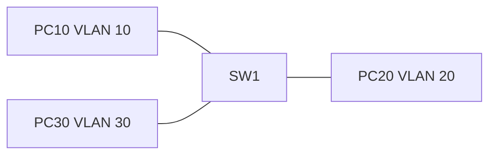

# 05 - VLAN - Virtual Local Area Network Configuration - Step by Step

> [!info] Outcome
> Create three Virtual Local Area Networks (VLANs), assign access ports, and prove that each VLAN forms a separate Layer 2 broadcast domain.

> [!warning] Interface-name check
> The examples use Cisco 2911/1941 router interfaces such as `GigabitEthernet0/0` and Cisco 2960 switch ports such as `FastEthernet0/1`. Check the labels on your Packet Tracer device and substitute the actual interface name when it differs.

## 1. Packet Tracer Support

**Yes**

## 2. Example Topology



### Devices and Cabling

| From | To | Cable / Link |
|---|---|---|
| PC10 | SW1 F0/1 | Copper straight-through |
| PC20 | SW1 F0/2 | Copper straight-through |
| PC30 | SW1 F0/3 | Copper straight-through |

## 3. Addressing Plan

| Device | Interface | Address / Setting | Default Gateway |
|---|---|---|---|
| PC10 | FastEthernet0 | 192.168.10.10 /24 | 192.168.10.1 |
| PC20 | FastEthernet0 | 192.168.20.10 /24 | 192.168.20.1 |
| PC30 | FastEthernet0 | 192.168.30.10 /24 | 192.168.30.1 |

## 4. Before You Configure

1. Place and rename every device exactly as shown.
2. Connect the interfaces in the cabling table.
3. Wait for links to become active before troubleshooting Layer 3.
4. Erase or inspect old lab configuration so it does not conflict with this example.

## 5. Step-by-Step Configuration

### Step 1 — Build the topology

Place the listed devices, rename them, and make each connection shown above.

### Step 2 — Confirm the addressing plan

Check that every address is unique, belongs to the stated subnet, and uses the correct mask or prefix length.

### Step 3 — Open each device

For IOS devices, select **CLI** and press Enter. For PCs and servers, use the named Packet Tracer desktop or services panel.

### Step 4 — Configure SW1

Open **SW1 → CLI**, press Enter, and enter the following commands exactly.

```cisco
enable
configure terminal
hostname SW1
vlan 10
 name ADMINISTRATION
vlan 20
 name STAFF
vlan 30
 name STUDENTS
exit
interface fastEthernet0/1
 description PC10_ADMIN
 switchport mode access
 switchport access vlan 10
 spanning-tree portfast
exit
interface fastEthernet0/2
 description PC20_STAFF
 switchport mode access
 switchport access vlan 20
 spanning-tree portfast
exit
interface fastEthernet0/3
 description PC30_STUDENTS
 switchport mode access
 switchport access vlan 30
 spanning-tree portfast
end
copy running-config startup-config
```

### Step 5 — Configure the PCs

Set each PC address from the table. The gateways are reserved for a later inter-VLAN routing guide.

## 6. Complete Device Configurations

Use these blocks when rebuilding the example from an empty Packet Tracer file. Each block belongs only to the device named above it.

### SW1

```cisco
enable
configure terminal
hostname SW1
vlan 10
 name ADMINISTRATION
vlan 20
 name STAFF
vlan 30
 name STUDENTS
exit
interface fastEthernet0/1
 description PC10_ADMIN
 switchport mode access
 switchport access vlan 10
 spanning-tree portfast
exit
interface fastEthernet0/2
 description PC20_STAFF
 switchport mode access
 switchport access vlan 20
 spanning-tree portfast
exit
interface fastEthernet0/3
 description PC30_STUDENTS
 switchport mode access
 switchport access vlan 30
 spanning-tree portfast
end
copy running-config startup-config
```

## 7. Key Configuration Logic

- Configure physical or logical interfaces before depending on a protocol that uses them.
- Use `no shutdown` on routed interfaces and switched virtual interfaces when required.
- Keep VLAN IDs, IP networks, masks, wildcard masks, and default gateways consistent with the addressing table.
- Save the configuration only after verification succeeds.


## 8. Verification Commands

Run the commands relevant to the device and compare the result with the addressing and topology tables.

- `show vlan brief`
- `show interfaces fastEthernet0/1 switchport`
- `show mac address-table dynamic`

## 9. Testing Matrix

| Test | Source | Destination / Check | Expected Result |
|---|---|---|---|
| VLAN membership | SW1 | show vlan brief | F0/1, F0/2, and F0/3 appear in VLANs 10, 20, and 30 |
| Isolation | PC10 | 192.168.20.10 | Fails until inter-VLAN routing exists |

## 10. Troubleshooting

| Symptom | Likely Cause | Check or Fix |
|---|---|---|
| Port remains in VLAN 1 | Access VLAN command missing or wrong interface | Re-enter switchport access vlan on the connected port |
| Same-VLAN hosts cannot ping | Incorrect PC subnet or port down | Check IP settings, cable, and show interfaces status |

## 11. Save and Finish

On every IOS device whose tests pass:

```cisco
copy running-config startup-config
```

Then save the Packet Tracer activity file with a descriptive version number.

## 12. Related Configuration Notes

- [[06 - IEEE 802.1Q Trunk Configuration - Step by Step]]
- [[07 - Router-on-a-Stick Inter-VLAN Routing - Step by Step]]
- [[08 - Multilayer Switch Inter-VLAN Routing - Step by Step]]
- [[09 - STP - Spanning Tree Protocol Root Bridge Configuration - Step by Step]]

Return to [[Configuration Library Dashboard]].
