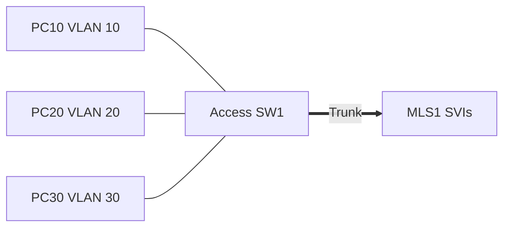

# 08 - Multilayer Switch Inter-VLAN Routing - Step by Step

> [!info] Outcome
> Use switched virtual interfaces on a multilayer switch to route traffic among three VLANs.

> [!warning] Interface-name check
> The examples use Cisco 2911/1941 router interfaces such as `GigabitEthernet0/0` and Cisco 2960 switch ports such as `FastEthernet0/1`. Check the labels on your Packet Tracer device and substitute the actual interface name when it differs.

## 1. Packet Tracer Support

**Yes**

## 2. Example Topology



### Devices and Cabling

| From | To | Cable / Link |
|---|---|---|
| PC10 | ASW1 F0/1 | Copper straight-through |
| PC20 | ASW1 F0/2 | Copper straight-through |
| PC30 | ASW1 F0/3 | Copper straight-through |
| ASW1 G0/1 | MLS1 G0/1 | Copper crossover or Automatic trunk |

## 3. Addressing Plan

| Device | Interface | Address / Setting | Default Gateway |
|---|---|---|---|
| MLS1 | VLAN 10 | 192.168.10.1 /24 | — |
| MLS1 | VLAN 20 | 192.168.20.1 /24 | — |
| MLS1 | VLAN 30 | 192.168.30.1 /24 | — |
| PC10 | FastEthernet0 | 192.168.10.10 /24 | 192.168.10.1 |
| PC20 | FastEthernet0 | 192.168.20.10 /24 | 192.168.20.1 |
| PC30 | FastEthernet0 | 192.168.30.10 /24 | 192.168.30.1 |

## 4. Before You Configure

1. Place and rename every device exactly as shown.
2. Connect the interfaces in the cabling table.
3. Wait for links to become active before troubleshooting Layer 3.
4. Erase or inspect old lab configuration so it does not conflict with this example.

## 5. Step-by-Step Configuration

### Step 1 — Build the topology

Place the listed devices, rename them, and make each connection shown above.

### Step 2 — Confirm the addressing plan

Check that every address is unique, belongs to the stated subnet, and uses the correct mask or prefix length.

### Step 3 — Open each device

For IOS devices, select **CLI** and press Enter. For PCs and servers, use the named Packet Tracer desktop or services panel.

### Step 4 — Configure MLS1

Open **MLS1 → CLI**, press Enter, and enter the following commands exactly.

```cisco
enable
configure terminal
hostname MLS1
ip routing
vlan 10
 name ADMINISTRATION
vlan 20
 name STAFF
vlan 30
 name STUDENTS
exit
interface vlan 10
 ip address 192.168.10.1 255.255.255.0
 no shutdown
interface vlan 20
 ip address 192.168.20.1 255.255.255.0
 no shutdown
interface vlan 30
 ip address 192.168.30.1 255.255.255.0
 no shutdown
interface gigabitEthernet0/1
 switchport mode trunk
 switchport trunk allowed vlan 10,20,30
end
copy running-config startup-config
```
### Step 5 — Configure ASW1

Open **ASW1 → CLI**, press Enter, and enter the following commands exactly.

```cisco
enable
configure terminal
hostname ASW1
vlan 10
 name ADMINISTRATION
vlan 20
 name STAFF
vlan 30
 name STUDENTS
exit
interface fastEthernet0/1
 switchport mode access
 switchport access vlan 10
 spanning-tree portfast
interface fastEthernet0/2
 switchport mode access
 switchport access vlan 20
 spanning-tree portfast
interface fastEthernet0/3
 switchport mode access
 switchport access vlan 30
 spanning-tree portfast
interface gigabitEthernet0/1
 switchport mode trunk
 switchport trunk allowed vlan 10,20,30
end
copy running-config startup-config
```

### Step 6 — Configure PCs

Enter each PC address and its matching SVI address as the default gateway.

## 6. Complete Device Configurations

Use these blocks when rebuilding the example from an empty Packet Tracer file. Each block belongs only to the device named above it.

### MLS1

```cisco
enable
configure terminal
hostname MLS1
ip routing
vlan 10
 name ADMINISTRATION
vlan 20
 name STAFF
vlan 30
 name STUDENTS
exit
interface vlan 10
 ip address 192.168.10.1 255.255.255.0
 no shutdown
interface vlan 20
 ip address 192.168.20.1 255.255.255.0
 no shutdown
interface vlan 30
 ip address 192.168.30.1 255.255.255.0
 no shutdown
interface gigabitEthernet0/1
 switchport mode trunk
 switchport trunk allowed vlan 10,20,30
end
copy running-config startup-config
```
### ASW1

```cisco
enable
configure terminal
hostname ASW1
vlan 10
 name ADMINISTRATION
vlan 20
 name STAFF
vlan 30
 name STUDENTS
exit
interface fastEthernet0/1
 switchport mode access
 switchport access vlan 10
 spanning-tree portfast
interface fastEthernet0/2
 switchport mode access
 switchport access vlan 20
 spanning-tree portfast
interface fastEthernet0/3
 switchport mode access
 switchport access vlan 30
 spanning-tree portfast
interface gigabitEthernet0/1
 switchport mode trunk
 switchport trunk allowed vlan 10,20,30
end
copy running-config startup-config
```

## 7. Key Configuration Logic

- Configure physical or logical interfaces before depending on a protocol that uses them.
- Use `no shutdown` on routed interfaces and switched virtual interfaces when required.
- Keep VLAN IDs, IP networks, masks, wildcard masks, and default gateways consistent with the addressing table.
- Save the configuration only after verification succeeds.


## 8. Verification Commands

Run the commands relevant to the device and compare the result with the addressing and topology tables.

- `show ip interface brief`
- `show ip route connected`
- `show interfaces trunk`
- `show vlan brief`

## 9. Testing Matrix

| Test | Source | Destination / Check | Expected Result |
|---|---|---|---|
| SVI gateway | PC20 | 192.168.20.1 | Success |
| Inter-VLAN | PC10 | 192.168.30.10 | Success |

## 10. Troubleshooting

| Symptom | Likely Cause | Check or Fix |
|---|---|---|
| SVI protocol is down | VLAN missing or no active member/trunk port | Create the VLAN and verify an active Layer 2 path |
| Gateways reply but inter-VLAN fails | ip routing missing | Enable ip routing on MLS1 |

## 11. Save and Finish

On every IOS device whose tests pass:

```cisco
copy running-config startup-config
```

Then save the Packet Tracer activity file with a descriptive version number.

## 12. Related Configuration Notes

- [[05 - VLAN - Virtual Local Area Network Configuration - Step by Step]]
- [[06 - IEEE 802.1Q Trunk Configuration - Step by Step]]
- [[07 - Router-on-a-Stick Inter-VLAN Routing - Step by Step]]
- [[09 - STP - Spanning Tree Protocol Root Bridge Configuration - Step by Step]]

Return to [[Configuration Library Dashboard]].
