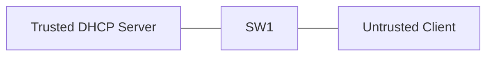

# 13 - DHCP Snooping, Dynamic ARP Inspection, and IP Source Guard - Step by Step

> [!info] Outcome
> Protect a user VLAN from rogue Dynamic Host Configuration Protocol (DHCP) replies, forged Address Resolution Protocol (ARP) messages, and source-address spoofing.

> [!warning] Interface-name check
> The examples use Cisco 2911/1941 router interfaces such as `GigabitEthernet0/0` and Cisco 2960 switch ports such as `FastEthernet0/1`. Check the labels on your Packet Tracer device and substitute the actual interface name when it differs.

## 1. Packet Tracer Support

**Partial**

## 2. Example Topology



### Devices and Cabling

| From | To | Cable / Link |
|---|---|---|
| DHCP Server | SW1 F0/24 | Copper straight-through trusted port |
| PC1 | SW1 F0/1 | Copper straight-through untrusted port |

## 3. Addressing Plan

| Device | Interface | Address / Setting | Default Gateway |
|---|---|---|---|
| DHCP Server | FastEthernet0 | 192.168.10.5 /24 | 192.168.10.1 |
| PC1 | FastEthernet0 | DHCP | 192.168.10.1 |
| Gateway | VLAN 10 | 192.168.10.1 /24 | — |

## 4. Before You Configure

1. Place and rename every device exactly as shown.
2. Connect the interfaces in the cabling table.
3. Wait for links to become active before troubleshooting Layer 3.
4. Erase or inspect old lab configuration so it does not conflict with this example.

## 5. Step-by-Step Configuration

### Step 1 — Build the topology

Place the listed devices, rename them, and make each connection shown above.

### Step 2 — Confirm the addressing plan

Check that every address is unique, belongs to the stated subnet, and uses the correct mask or prefix length.

### Step 3 — Open each device

For IOS devices, select **CLI** and press Enter. For PCs and servers, use the named Packet Tracer desktop or services panel.

### Step 4 — Configure SW1

Open **SW1 → CLI**, press Enter, and enter the following commands exactly.

```cisco
enable
configure terminal
hostname SW1
vlan 10
 name USERS
exit
ip dhcp snooping
ip dhcp snooping vlan 10
ip arp inspection vlan 10
interface fastEthernet0/24
 description TRUSTED_DHCP_SERVER
 switchport mode access
 switchport access vlan 10
 ip dhcp snooping trust
 ip arp inspection trust
exit
interface fastEthernet0/1
 description USER_EDGE_PORT
 switchport mode access
 switchport access vlan 10
 ip dhcp snooping limit rate 15
 ip verify source
 spanning-tree portfast
 spanning-tree bpduguard enable
end
copy running-config startup-config
```

### Step 5 — Configure the DHCP server

Set the server to `192.168.10.5/24`, enable DHCP, and create a pool for `192.168.10.0/24` with gateway `192.168.10.1`.
### Step 6 — Configure PC1

Choose **DHCP** in **Desktop → IP Configuration** and verify the assigned address.

## 6. Complete Device Configurations

Use these blocks when rebuilding the example from an empty Packet Tracer file. Each block belongs only to the device named above it.

### SW1

```cisco
enable
configure terminal
hostname SW1
vlan 10
 name USERS
exit
ip dhcp snooping
ip dhcp snooping vlan 10
ip arp inspection vlan 10
interface fastEthernet0/24
 description TRUSTED_DHCP_SERVER
 switchport mode access
 switchport access vlan 10
 ip dhcp snooping trust
 ip arp inspection trust
exit
interface fastEthernet0/1
 description USER_EDGE_PORT
 switchport mode access
 switchport access vlan 10
 ip dhcp snooping limit rate 15
 ip verify source
 spanning-tree portfast
 spanning-tree bpduguard enable
end
copy running-config startup-config
```

## 7. Key Configuration Logic

- Configure physical or logical interfaces before depending on a protocol that uses them.
- Use `no shutdown` on routed interfaces and switched virtual interfaces when required.
- Keep VLAN IDs, IP networks, masks, wildcard masks, and default gateways consistent with the addressing table.
- Save the configuration only after verification succeeds.

> [!note] Teaching note
> Packet Tracer support varies by switch image for Dynamic ARP Inspection and IP Source Guard. Use Cisco Modeling Labs, EVE-NG, GNS3, or real switches if a command is unavailable.

## 8. Verification Commands

Run the commands relevant to the device and compare the result with the addressing and topology tables.

- `show ip dhcp snooping`
- `show ip dhcp snooping binding`
- `show ip arp inspection`
- `show ip verify source`

## 9. Testing Matrix

| Test | Source | Destination / Check | Expected Result |
|---|---|---|---|
| DHCP lease | PC1 | Trusted DHCP server | Client receives a valid VLAN 10 lease |
| Binding | SW1 | show ip dhcp snooping binding | PC1 MAC, IP, VLAN, and port appear |

## 10. Troubleshooting

| Symptom | Likely Cause | Check or Fix |
|---|---|---|
| Client cannot obtain a lease | Server-facing port not trusted | Trust only the actual server/uplink port |
| DAI drops legitimate static host | No DHCP snooping binding | Use an ARP ACL or supported static binding design |

## 11. Save and Finish

On every IOS device whose tests pass:

```cisco
copy running-config startup-config
```

Then save the Packet Tracer activity file with a descriptive version number.

## 12. Related Configuration Notes

- [[05 - VLAN - Virtual Local Area Network Configuration - Step by Step]]
- [[06 - IEEE 802.1Q Trunk Configuration - Step by Step]]
- [[07 - Router-on-a-Stick Inter-VLAN Routing - Step by Step]]
- [[08 - Multilayer Switch Inter-VLAN Routing - Step by Step]]

Return to [[Configuration Library Dashboard]].
