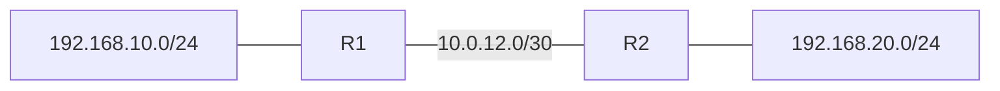

# 18 - EIGRP - Enhanced Interior Gateway Routing Protocol - Step by Step

> [!info] Outcome
> Form an Enhanced Interior Gateway Routing Protocol (EIGRP) adjacency in autonomous system 100 and advertise two LANs without automatic summarisation.

> [!warning] Interface-name check
> The examples use Cisco 2911/1941 router interfaces such as `GigabitEthernet0/0` and Cisco 2960 switch ports such as `FastEthernet0/1`. Check the labels on your Packet Tracer device and substitute the actual interface name when it differs.

## 1. Packet Tracer Support

**Yes**

## 2. Example Topology



### Devices and Cabling

| From | To | Cable / Link |
|---|---|---|
| PC1 | R1 G0/0 through switch | Copper straight-through |
| R1 G0/1 | R2 G0/1 | Copper crossover or Automatic |
| R2 G0/0 | PC2 through switch | Copper straight-through |

## 3. Addressing Plan

| Device | Interface | Address / Setting | Default Gateway |
|---|---|---|---|
| R1 | G0/0 | 192.168.10.1 /24 | — |
| R1 | G0/1 | 10.0.12.1 /30 | — |
| R2 | G0/1 | 10.0.12.2 /30 | — |
| R2 | G0/0 | 192.168.20.1 /24 | — |
| PC1 | FastEthernet0 | 192.168.10.10 /24 | 192.168.10.1 |
| PC2 | FastEthernet0 | 192.168.20.10 /24 | 192.168.20.1 |

## 4. Before You Configure

1. Place and rename every device exactly as shown.
2. Connect the interfaces in the cabling table.
3. Wait for links to become active before troubleshooting Layer 3.
4. Erase or inspect old lab configuration so it does not conflict with this example.

## 5. Step-by-Step Configuration

### Step 1 — Build the topology

Place the listed devices, rename them, and make each connection shown above.

### Step 2 — Confirm the addressing plan

Check that every address is unique, belongs to the stated subnet, and uses the correct mask or prefix length.

### Step 3 — Open each device

For IOS devices, select **CLI** and press Enter. For PCs and servers, use the named Packet Tracer desktop or services panel.

### Step 4 — Configure R1

Open **R1 → CLI**, press Enter, and enter the following commands exactly.

```cisco
enable
configure terminal
hostname R1
interface gigabitEthernet0/0
 ip address 192.168.10.1 255.255.255.0
 no shutdown
interface gigabitEthernet0/1
 ip address 10.0.12.1 255.255.255.252
 no shutdown
router eigrp 100
 network 192.168.10.0 0.0.0.255
 network 10.0.12.0 0.0.0.3
 passive-interface gigabitEthernet0/0
 no auto-summary
end
copy running-config startup-config
```
### Step 5 — Configure R2

Open **R2 → CLI**, press Enter, and enter the following commands exactly.

```cisco
enable
configure terminal
hostname R2
interface gigabitEthernet0/0
 ip address 192.168.20.1 255.255.255.0
 no shutdown
interface gigabitEthernet0/1
 ip address 10.0.12.2 255.255.255.252
 no shutdown
router eigrp 100
 network 192.168.20.0 0.0.0.255
 network 10.0.12.0 0.0.0.3
 passive-interface gigabitEthernet0/0
 no auto-summary
end
copy running-config startup-config
```

### Step 6 — Configure the PCs

Set the two static host addresses and local `.1` default gateways.

## 6. Complete Device Configurations

Use these blocks when rebuilding the example from an empty Packet Tracer file. Each block belongs only to the device named above it.

### R1

```cisco
enable
configure terminal
hostname R1
interface gigabitEthernet0/0
 ip address 192.168.10.1 255.255.255.0
 no shutdown
interface gigabitEthernet0/1
 ip address 10.0.12.1 255.255.255.252
 no shutdown
router eigrp 100
 network 192.168.10.0 0.0.0.255
 network 10.0.12.0 0.0.0.3
 passive-interface gigabitEthernet0/0
 no auto-summary
end
copy running-config startup-config
```
### R2

```cisco
enable
configure terminal
hostname R2
interface gigabitEthernet0/0
 ip address 192.168.20.1 255.255.255.0
 no shutdown
interface gigabitEthernet0/1
 ip address 10.0.12.2 255.255.255.252
 no shutdown
router eigrp 100
 network 192.168.20.0 0.0.0.255
 network 10.0.12.0 0.0.0.3
 passive-interface gigabitEthernet0/0
 no auto-summary
end
copy running-config startup-config
```

## 7. Key Configuration Logic

- Configure physical or logical interfaces before depending on a protocol that uses them.
- Use `no shutdown` on routed interfaces and switched virtual interfaces when required.
- Keep VLAN IDs, IP networks, masks, wildcard masks, and default gateways consistent with the addressing table.
- Save the configuration only after verification succeeds.


## 8. Verification Commands

Run the commands relevant to the device and compare the result with the addressing and topology tables.

- `show ip eigrp neighbors`
- `show ip eigrp topology`
- `show ip route eigrp`
- `show ip protocols`

## 9. Testing Matrix

| Test | Source | Destination / Check | Expected Result |
|---|---|---|---|
| Adjacency | R1 | R2 | Neighbor 10.0.12.2 appears |
| Learned route | R1 | 192.168.20.0/24 | Route marked D |
| End-to-end | PC1 | 192.168.20.10 | Success |

## 10. Troubleshooting

| Symptom | Likely Cause | Check or Fix |
|---|---|---|
| No neighbor | Autonomous system mismatch or subnet issue | Use AS 100 and matching /30 addresses on both routers |
| Neighbor present, route missing | LAN omitted or passive setting applied to transit link | Check show ip protocols and network statements |

## 11. Save and Finish

On every IOS device whose tests pass:

```cisco
copy running-config startup-config
```

Then save the Packet Tracer activity file with a descriptive version number.

## 12. Related Configuration Notes

- [[14 - IPv4 - Internet Protocol Version 4 Static, Default, and Floating Static Routing - Step by Step]]
- [[15 - RIPv2 - Routing Information Protocol Version 2 - Step by Step]]
- [[16 - OSPF - Open Shortest Path First Single-Area Configuration - Step by Step]]
- [[17 - OSPF - Open Shortest Path First Multi-Area Configuration - Step by Step]]

Return to [[Configuration Library Dashboard]].
