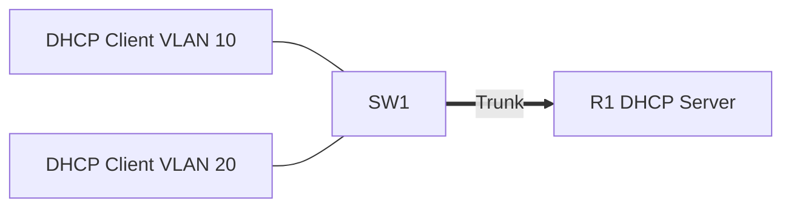

# 19 - DHCP - Dynamic Host Configuration Protocol on a Cisco Router - Step by Step

> [!info] Outcome
> Configure a Cisco router as a Dynamic Host Configuration Protocol (DHCP) server for VLANs 10 and 20, including excluded addresses and Domain Name System (DNS) settings.

> [!warning] Interface-name check
> The examples use Cisco 2911/1941 router interfaces such as `GigabitEthernet0/0` and Cisco 2960 switch ports such as `FastEthernet0/1`. Check the labels on your Packet Tracer device and substitute the actual interface name when it differs.

## 1. Packet Tracer Support

**Yes**

## 2. Example Topology



### Devices and Cabling

| From | To | Cable / Link |
|---|---|---|
| PC10 | SW1 F0/1 | Copper straight-through |
| PC20 | SW1 F0/2 | Copper straight-through |
| SW1 G0/1 | R1 G0/0 | Copper straight-through trunk |

## 3. Addressing Plan

| Device | Interface | Address / Setting | Default Gateway |
|---|---|---|---|
| R1 | G0/0.10 | 192.168.10.1 /24 | — |
| R1 | G0/0.20 | 192.168.20.1 /24 | — |
| PC10 | FastEthernet0 | DHCP from VLAN10 pool | 192.168.10.1 |
| PC20 | FastEthernet0 | DHCP from VLAN20 pool | 192.168.20.1 |

## 4. Before You Configure

1. Place and rename every device exactly as shown.
2. Connect the interfaces in the cabling table.
3. Wait for links to become active before troubleshooting Layer 3.
4. Erase or inspect old lab configuration so it does not conflict with this example.

## 5. Step-by-Step Configuration

### Step 1 — Build the topology

Place the listed devices, rename them, and make each connection shown above.

### Step 2 — Confirm the addressing plan

Check that every address is unique, belongs to the stated subnet, and uses the correct mask or prefix length.

### Step 3 — Open each device

For IOS devices, select **CLI** and press Enter. For PCs and servers, use the named Packet Tracer desktop or services panel.

### Step 4 — Configure SW1

Open **SW1 → CLI**, press Enter, and enter the following commands exactly.

```cisco
enable
configure terminal
hostname SW1
vlan 10
vlan 20
interface fastEthernet0/1
 switchport mode access
 switchport access vlan 10
 spanning-tree portfast
interface fastEthernet0/2
 switchport mode access
 switchport access vlan 20
 spanning-tree portfast
interface gigabitEthernet0/1
 switchport mode trunk
 switchport trunk allowed vlan 10,20
end
copy running-config startup-config
```
### Step 5 — Configure R1

Open **R1 → CLI**, press Enter, and enter the following commands exactly.

```cisco
enable
configure terminal
hostname R1
interface gigabitEthernet0/0
 no ip address
 no shutdown
interface gigabitEthernet0/0.10
 encapsulation dot1Q 10
 ip address 192.168.10.1 255.255.255.0
interface gigabitEthernet0/0.20
 encapsulation dot1Q 20
 ip address 192.168.20.1 255.255.255.0
exit
ip dhcp excluded-address 192.168.10.1 192.168.10.20
ip dhcp excluded-address 192.168.20.1 192.168.20.20
ip dhcp pool VLAN10
 network 192.168.10.0 255.255.255.0
 default-router 192.168.10.1
 dns-server 192.168.50.10
 domain-name campus.lab
exit
ip dhcp pool VLAN20
 network 192.168.20.0 255.255.255.0
 default-router 192.168.20.1
 dns-server 192.168.50.10
 domain-name campus.lab
end
copy running-config startup-config
```

### Step 6 — Request DHCP on both PCs

Open **Desktop → IP Configuration** and select **DHCP**. Use **Command Prompt → ipconfig /all** to confirm the lease.

## 6. Complete Device Configurations

Use these blocks when rebuilding the example from an empty Packet Tracer file. Each block belongs only to the device named above it.

### SW1

```cisco
enable
configure terminal
hostname SW1
vlan 10
vlan 20
interface fastEthernet0/1
 switchport mode access
 switchport access vlan 10
 spanning-tree portfast
interface fastEthernet0/2
 switchport mode access
 switchport access vlan 20
 spanning-tree portfast
interface gigabitEthernet0/1
 switchport mode trunk
 switchport trunk allowed vlan 10,20
end
copy running-config startup-config
```
### R1

```cisco
enable
configure terminal
hostname R1
interface gigabitEthernet0/0
 no ip address
 no shutdown
interface gigabitEthernet0/0.10
 encapsulation dot1Q 10
 ip address 192.168.10.1 255.255.255.0
interface gigabitEthernet0/0.20
 encapsulation dot1Q 20
 ip address 192.168.20.1 255.255.255.0
exit
ip dhcp excluded-address 192.168.10.1 192.168.10.20
ip dhcp excluded-address 192.168.20.1 192.168.20.20
ip dhcp pool VLAN10
 network 192.168.10.0 255.255.255.0
 default-router 192.168.10.1
 dns-server 192.168.50.10
 domain-name campus.lab
exit
ip dhcp pool VLAN20
 network 192.168.20.0 255.255.255.0
 default-router 192.168.20.1
 dns-server 192.168.50.10
 domain-name campus.lab
end
copy running-config startup-config
```

## 7. Key Configuration Logic

- Configure physical or logical interfaces before depending on a protocol that uses them.
- Use `no shutdown` on routed interfaces and switched virtual interfaces when required.
- Keep VLAN IDs, IP networks, masks, wildcard masks, and default gateways consistent with the addressing table.
- Save the configuration only after verification succeeds.


## 8. Verification Commands

Run the commands relevant to the device and compare the result with the addressing and topology tables.

- `show ip dhcp pool`
- `show ip dhcp binding`
- `show ip dhcp conflict`
- `show interfaces trunk`

## 9. Testing Matrix

| Test | Source | Destination / Check | Expected Result |
|---|---|---|---|
| VLAN 10 lease | PC10 | DHCP | Receives 192.168.10.21 or later |
| VLAN 20 lease | PC20 | DHCP | Receives 192.168.20.21 or later |
| Gateway | Each PC | Assigned default gateway | Matches the local .1 address |

## 10. Troubleshooting

| Symptom | Likely Cause | Check or Fix |
|---|---|---|
| APIPA address | No DHCP offer reaches client | Check VLAN, trunk, subinterface, pool network, and service state |
| Wrong gateway | Pool default-router value is incorrect | Match it to the appropriate router subinterface |

## 11. Save and Finish

On every IOS device whose tests pass:

```cisco
copy running-config startup-config
```

Then save the Packet Tracer activity file with a descriptive version number.

## 12. Related Configuration Notes

- [[20 - Central DHCP Server with DHCP Relay - Step by Step]]
- [[21 - DNS - Domain Name System Server - Step by Step]]
- [[22 - NTP - Network Time Protocol - Step by Step]]
- [[23 - FTP and TFTP File Services - Step by Step]]

Return to [[Configuration Library Dashboard]].
