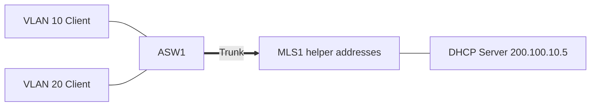

# 20 - Central DHCP Server with DHCP Relay - Step by Step

> [!info] Outcome
> Serve clients in multiple VLANs from a dedicated Packet Tracer DHCP server at 200.100.10.5 by using DHCP relay on each gateway.

> [!warning] Interface-name check
> The examples use Cisco 2911/1941 router interfaces such as `GigabitEthernet0/0` and Cisco 2960 switch ports such as `FastEthernet0/1`. Check the labels on your Packet Tracer device and substitute the actual interface name when it differs.

## 1. Packet Tracer Support

**Yes**

## 2. Example Topology



### Devices and Cabling

| From | To | Cable / Link |
|---|---|---|
| PC10 | ASW1 F0/1 | Copper straight-through |
| PC20 | ASW1 F0/2 | Copper straight-through |
| ASW1 G0/1 | MLS1 G0/1 | Trunk |
| DHCP Server | MLS1 F0/24 | Copper straight-through server VLAN |

## 3. Addressing Plan

| Device | Interface | Address / Setting | Default Gateway |
|---|---|---|---|
| MLS1 | VLAN 10 | 192.168.10.1 /24 | — |
| MLS1 | VLAN 20 | 192.168.20.1 /24 | — |
| MLS1 | VLAN 50 | 200.100.10.1 /24 | — |
| DHCP Server | FastEthernet0 | 200.100.10.5 /24 | 200.100.10.1 |
| PC10/PC20 | FastEthernet0 | DHCP | From matching pool |

## 4. Before You Configure

1. Place and rename every device exactly as shown.
2. Connect the interfaces in the cabling table.
3. Wait for links to become active before troubleshooting Layer 3.
4. Erase or inspect old lab configuration so it does not conflict with this example.

## 5. Step-by-Step Configuration

### Step 1 — Build the topology

Place the listed devices, rename them, and make each connection shown above.

### Step 2 — Confirm the addressing plan

Check that every address is unique, belongs to the stated subnet, and uses the correct mask or prefix length.

### Step 3 — Open each device

For IOS devices, select **CLI** and press Enter. For PCs and servers, use the named Packet Tracer desktop or services panel.

### Step 4 — Configure MLS1

Open **MLS1 → CLI**, press Enter, and enter the following commands exactly.

```cisco
enable
configure terminal
hostname MLS1
ip routing
vlan 10
 name ADMINISTRATION
vlan 20
 name STAFF
vlan 50
 name SERVERS
interface vlan 10
 ip address 192.168.10.1 255.255.255.0
 ip helper-address 200.100.10.5
 no shutdown
interface vlan 20
 ip address 192.168.20.1 255.255.255.0
 ip helper-address 200.100.10.5
 no shutdown
interface vlan 50
 ip address 200.100.10.1 255.255.255.0
 no shutdown
interface fastEthernet0/24
 switchport mode access
 switchport access vlan 50
 spanning-tree portfast
interface gigabitEthernet0/1
 switchport mode trunk
 switchport trunk allowed vlan 10,20,50
end
copy running-config startup-config
```
### Step 5 — Configure ASW1

Open **ASW1 → CLI**, press Enter, and enter the following commands exactly.

```cisco
enable
configure terminal
hostname ASW1
vlan 10
vlan 20
vlan 50
interface fastEthernet0/1
 switchport mode access
 switchport access vlan 10
 spanning-tree portfast
interface fastEthernet0/2
 switchport mode access
 switchport access vlan 20
 spanning-tree portfast
interface gigabitEthernet0/1
 switchport mode trunk
 switchport trunk allowed vlan 10,20,50
end
copy running-config startup-config
```

### Step 6 — Configure the dedicated server

Set `200.100.10.5/24`, gateway `200.100.10.1`. In **Services → DHCP**, create pool `VLAN10` with gateway `192.168.10.1`, start IP `192.168.10.100`, mask `255.255.255.0`, DNS `200.100.10.5`; add `VLAN20` with gateway `192.168.20.1` and start IP `192.168.20.100`. Turn DHCP **On**.
### Step 7 — Request client leases

Select **DHCP** on PC10 and PC20, then verify the correct subnet, gateway, and DNS address.

## 6. Complete Device Configurations

Use these blocks when rebuilding the example from an empty Packet Tracer file. Each block belongs only to the device named above it.

### MLS1

```cisco
enable
configure terminal
hostname MLS1
ip routing
vlan 10
 name ADMINISTRATION
vlan 20
 name STAFF
vlan 50
 name SERVERS
interface vlan 10
 ip address 192.168.10.1 255.255.255.0
 ip helper-address 200.100.10.5
 no shutdown
interface vlan 20
 ip address 192.168.20.1 255.255.255.0
 ip helper-address 200.100.10.5
 no shutdown
interface vlan 50
 ip address 200.100.10.1 255.255.255.0
 no shutdown
interface fastEthernet0/24
 switchport mode access
 switchport access vlan 50
 spanning-tree portfast
interface gigabitEthernet0/1
 switchport mode trunk
 switchport trunk allowed vlan 10,20,50
end
copy running-config startup-config
```
### ASW1

```cisco
enable
configure terminal
hostname ASW1
vlan 10
vlan 20
vlan 50
interface fastEthernet0/1
 switchport mode access
 switchport access vlan 10
 spanning-tree portfast
interface fastEthernet0/2
 switchport mode access
 switchport access vlan 20
 spanning-tree portfast
interface gigabitEthernet0/1
 switchport mode trunk
 switchport trunk allowed vlan 10,20,50
end
copy running-config startup-config
```

## 7. Key Configuration Logic

- Configure physical or logical interfaces before depending on a protocol that uses them.
- Use `no shutdown` on routed interfaces and switched virtual interfaces when required.
- Keep VLAN IDs, IP networks, masks, wildcard masks, and default gateways consistent with the addressing table.
- Save the configuration only after verification succeeds.


## 8. Verification Commands

Run the commands relevant to the device and compare the result with the addressing and topology tables.

- `show ip interface brief`
- `show running-config interface vlan 10`
- `show interfaces trunk`
- `ipconfig /all`

## 9. Testing Matrix

| Test | Source | Destination / Check | Expected Result |
|---|---|---|---|
| Server reachability | MLS1 | 200.100.10.5 | Success |
| VLAN 10 lease | PC10 | DHCP | 192.168.10.100+ and gateway 192.168.10.1 |
| VLAN 20 lease | PC20 | DHCP | 192.168.20.100+ and gateway 192.168.20.1 |

## 10. Troubleshooting

| Symptom | Likely Cause | Check or Fix |
|---|---|---|
| Only local server VLAN works | Helper address missing | Add ip helper-address to every remote client SVI |
| No pools selected | Server pool gateway/network does not match relay interface | Match each pool to its client subnet and default gateway |

## 11. Save and Finish

On every IOS device whose tests pass:

```cisco
copy running-config startup-config
```

Then save the Packet Tracer activity file with a descriptive version number.

## 12. Related Configuration Notes

- [[19 - DHCP - Dynamic Host Configuration Protocol on a Cisco Router - Step by Step]]
- [[21 - DNS - Domain Name System Server - Step by Step]]
- [[22 - NTP - Network Time Protocol - Step by Step]]
- [[23 - FTP and TFTP File Services - Step by Step]]

Return to [[Configuration Library Dashboard]].
