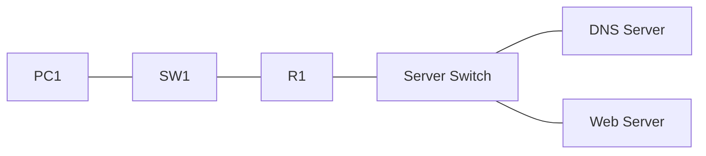

# 21 - DNS - Domain Name System Server - Step by Step

> [!info] Outcome
> Configure a Packet Tracer Domain Name System (DNS) server and resolve a web-server name from a client.

> [!warning] Interface-name check
> The examples use Cisco 2911/1941 router interfaces such as `GigabitEthernet0/0` and Cisco 2960 switch ports such as `FastEthernet0/1`. Check the labels on your Packet Tracer device and substitute the actual interface name when it differs.

## 1. Packet Tracer Support

**Yes**

## 2. Example Topology



### Devices and Cabling

| From | To | Cable / Link |
|---|---|---|
| PC1 | SW1 F0/1 | Copper straight-through |
| SW1 | R1 G0/0 | Copper straight-through |
| R1 G0/1 | SW2 | Copper straight-through |
| DNS and Web servers | SW2 access ports | Copper straight-through |

## 3. Addressing Plan

| Device | Interface | Address / Setting | Default Gateway |
|---|---|---|---|
| R1 | G0/0 | 192.168.10.1 /24 | — |
| R1 | G0/1 | 192.168.50.1 /24 | — |
| PC1 | FastEthernet0 | 192.168.10.10 /24 | 192.168.10.1 |
| DNS Server | FastEthernet0 | 192.168.50.10 /24 | 192.168.50.1 |
| Web Server | FastEthernet0 | 192.168.50.20 /24 | 192.168.50.1 |

## 4. Before You Configure

1. Place and rename every device exactly as shown.
2. Connect the interfaces in the cabling table.
3. Wait for links to become active before troubleshooting Layer 3.
4. Erase or inspect old lab configuration so it does not conflict with this example.

## 5. Step-by-Step Configuration

### Step 1 — Build the topology

Place the listed devices, rename them, and make each connection shown above.

### Step 2 — Confirm the addressing plan

Check that every address is unique, belongs to the stated subnet, and uses the correct mask or prefix length.

### Step 3 — Open each device

For IOS devices, select **CLI** and press Enter. For PCs and servers, use the named Packet Tracer desktop or services panel.

### Step 4 — Configure R1

Open **R1 → CLI**, press Enter, and enter the following commands exactly.

```cisco
enable
configure terminal
hostname R1
interface gigabitEthernet0/0
 ip address 192.168.10.1 255.255.255.0
 no shutdown
interface gigabitEthernet0/1
 ip address 192.168.50.1 255.255.255.0
 no shutdown
end
copy running-config startup-config
```

### Step 5 — Configure the DNS server

Set `192.168.50.10/24`, gateway `192.168.50.1`. Open **Services → DNS**, turn it **On**, and add A record `www.campus.lab` → `192.168.50.20`.
### Step 6 — Configure the web server

Set `192.168.50.20/24`, gateway `192.168.50.1`, then enable **Services → HTTP**.
### Step 7 — Configure PC1

Set `192.168.10.10/24`, gateway `192.168.10.1`, and DNS server `192.168.50.10`.

## 6. Complete Device Configurations

Use these blocks when rebuilding the example from an empty Packet Tracer file. Each block belongs only to the device named above it.

### R1

```cisco
enable
configure terminal
hostname R1
interface gigabitEthernet0/0
 ip address 192.168.10.1 255.255.255.0
 no shutdown
interface gigabitEthernet0/1
 ip address 192.168.50.1 255.255.255.0
 no shutdown
end
copy running-config startup-config
```

## 7. Key Configuration Logic

- Configure physical or logical interfaces before depending on a protocol that uses them.
- Use `no shutdown` on routed interfaces and switched virtual interfaces when required.
- Keep VLAN IDs, IP networks, masks, wildcard masks, and default gateways consistent with the addressing table.
- Save the configuration only after verification succeeds.


## 8. Verification Commands

Run the commands relevant to the device and compare the result with the addressing and topology tables.

- `show ip interface brief`
- `ping 192.168.50.10`
- `nslookup www.campus.lab`

## 9. Testing Matrix

| Test | Source | Destination / Check | Expected Result |
|---|---|---|---|
| DNS reachability | PC1 | 192.168.50.10 | Success |
| Name resolution | PC1 | www.campus.lab | Resolves to 192.168.50.20 |
| Web by name | PC1 browser | http://www.campus.lab | Page opens |

## 10. Troubleshooting

| Symptom | Likely Cause | Check or Fix |
|---|---|---|
| IP works but name fails | Wrong PC DNS setting or missing A record | Set DNS to 192.168.50.10 and add the exact record |
| Name resolves but page fails | HTTP service off | Enable HTTP on the web server |

## 11. Save and Finish

On every IOS device whose tests pass:

```cisco
copy running-config startup-config
```

Then save the Packet Tracer activity file with a descriptive version number.

## 12. Related Configuration Notes

- [[19 - DHCP - Dynamic Host Configuration Protocol on a Cisco Router - Step by Step]]
- [[20 - Central DHCP Server with DHCP Relay - Step by Step]]
- [[22 - NTP - Network Time Protocol - Step by Step]]
- [[23 - FTP and TFTP File Services - Step by Step]]

Return to [[Configuration Library Dashboard]].
