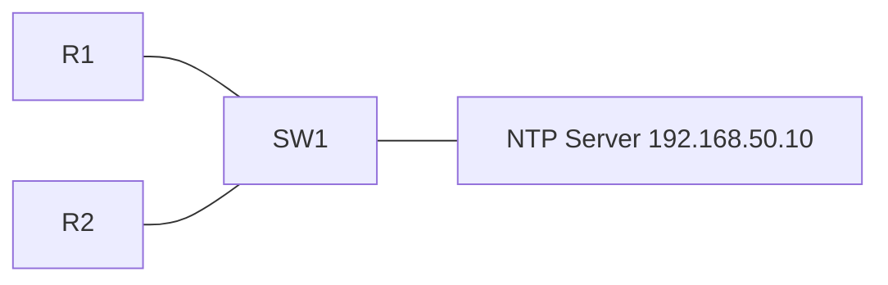

# 22 - NTP - Network Time Protocol - Step by Step

> [!info] Outcome
> Synchronise Cisco routers and switches to a Packet Tracer Network Time Protocol (NTP) server and verify clock state.

> [!warning] Interface-name check
> The examples use Cisco 2911/1941 router interfaces such as `GigabitEthernet0/0` and Cisco 2960 switch ports such as `FastEthernet0/1`. Check the labels on your Packet Tracer device and substitute the actual interface name when it differs.

## 1. Packet Tracer Support

**Yes**

## 2. Example Topology



### Devices and Cabling

| From | To | Cable / Link |
|---|---|---|
| R1 G0/0 | SW1 G0/1 | Copper straight-through |
| R2 G0/0 | SW1 G0/2 | Copper straight-through |
| NTP Server | SW1 F0/1 | Copper straight-through |

## 3. Addressing Plan

| Device | Interface | Address / Setting | Default Gateway |
|---|---|---|---|
| R1 | G0/0 | 192.168.50.1 /24 | — |
| R2 | G0/0 | 192.168.50.2 /24 | — |
| NTP Server | FastEthernet0 | 192.168.50.10 /24 | 192.168.50.1 |

## 4. Before You Configure

1. Place and rename every device exactly as shown.
2. Connect the interfaces in the cabling table.
3. Wait for links to become active before troubleshooting Layer 3.
4. Erase or inspect old lab configuration so it does not conflict with this example.

## 5. Step-by-Step Configuration

### Step 1 — Build the topology

Place the listed devices, rename them, and make each connection shown above.

### Step 2 — Confirm the addressing plan

Check that every address is unique, belongs to the stated subnet, and uses the correct mask or prefix length.

### Step 3 — Open each device

For IOS devices, select **CLI** and press Enter. For PCs and servers, use the named Packet Tracer desktop or services panel.

### Step 4 — Configure R1

Open **R1 → CLI**, press Enter, and enter the following commands exactly.

```cisco
enable
configure terminal
hostname R1
interface gigabitEthernet0/0
 ip address 192.168.50.1 255.255.255.0
 no shutdown
exit
clock timezone LKT 5 30
ntp server 192.168.50.10
end
copy running-config startup-config
```
### Step 5 — Configure R2

Open **R2 → CLI**, press Enter, and enter the following commands exactly.

```cisco
enable
configure terminal
hostname R2
interface gigabitEthernet0/0
 ip address 192.168.50.2 255.255.255.0
 no shutdown
exit
clock timezone LKT 5 30
ntp server 192.168.50.10
end
copy running-config startup-config
```

### Step 6 — Configure the NTP server

Set `192.168.50.10/24`, gateway `192.168.50.1`. Open **Services → NTP**, turn it **On**, and set the displayed date/time if the activity requires it.

## 6. Complete Device Configurations

Use these blocks when rebuilding the example from an empty Packet Tracer file. Each block belongs only to the device named above it.

### R1

```cisco
enable
configure terminal
hostname R1
interface gigabitEthernet0/0
 ip address 192.168.50.1 255.255.255.0
 no shutdown
exit
clock timezone LKT 5 30
ntp server 192.168.50.10
end
copy running-config startup-config
```
### R2

```cisco
enable
configure terminal
hostname R2
interface gigabitEthernet0/0
 ip address 192.168.50.2 255.255.255.0
 no shutdown
exit
clock timezone LKT 5 30
ntp server 192.168.50.10
end
copy running-config startup-config
```

## 7. Key Configuration Logic

- Configure physical or logical interfaces before depending on a protocol that uses them.
- Use `no shutdown` on routed interfaces and switched virtual interfaces when required.
- Keep VLAN IDs, IP networks, masks, wildcard masks, and default gateways consistent with the addressing table.
- Save the configuration only after verification succeeds.

> [!note] Teaching note
> Packet Tracer NTP convergence and output are simplified compared with a real IOS device.

## 8. Verification Commands

Run the commands relevant to the device and compare the result with the addressing and topology tables.

- `show clock detail`
- `show ntp associations`
- `show ntp status`
- `ping 192.168.50.10`

## 9. Testing Matrix

| Test | Source | Destination / Check | Expected Result |
|---|---|---|---|
| Server reachability | R1 and R2 | 192.168.50.10 | Success |
| Association | R1 and R2 | show ntp associations | Server appears; selected server may show * |
| Time | R1 and R2 | show clock detail | Clocks agree after convergence |

## 10. Troubleshooting

| Symptom | Likely Cause | Check or Fix |
|---|---|---|
| Unsynchronised | Insufficient wait time or unreachable server | Ping the server and allow simulation time to advance |
| Wrong displayed local time | Timezone missing or incorrect | Set clock timezone without changing the NTP source |

## 11. Save and Finish

On every IOS device whose tests pass:

```cisco
copy running-config startup-config
```

Then save the Packet Tracer activity file with a descriptive version number.

## 12. Related Configuration Notes

- [[19 - DHCP - Dynamic Host Configuration Protocol on a Cisco Router - Step by Step]]
- [[20 - Central DHCP Server with DHCP Relay - Step by Step]]
- [[21 - DNS - Domain Name System Server - Step by Step]]
- [[23 - FTP and TFTP File Services - Step by Step]]

Return to [[Configuration Library Dashboard]].
