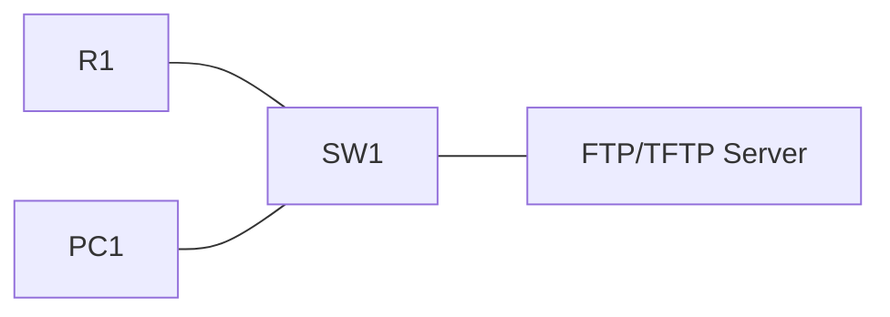

# 23 - FTP and TFTP File Services - Step by Step

> [!info] Outcome
> Configure Packet Tracer File Transfer Protocol (FTP) and Trivial File Transfer Protocol (TFTP) services, test user authentication, and transfer router files.

> [!warning] Interface-name check
> The examples use Cisco 2911/1941 router interfaces such as `GigabitEthernet0/0` and Cisco 2960 switch ports such as `FastEthernet0/1`. Check the labels on your Packet Tracer device and substitute the actual interface name when it differs.

## 1. Packet Tracer Support

**Yes**

## 2. Example Topology



### Devices and Cabling

| From | To | Cable / Link |
|---|---|---|
| R1 G0/0 | SW1 G0/1 | Copper straight-through |
| PC1 | SW1 F0/1 | Copper straight-through |
| File Server | SW1 F0/2 | Copper straight-through |

## 3. Addressing Plan

| Device | Interface | Address / Setting | Default Gateway |
|---|---|---|---|
| R1 | G0/0 | 192.168.50.1 /24 | — |
| File Server | FastEthernet0 | 192.168.50.10 /24 | 192.168.50.1 |
| PC1 | FastEthernet0 | 192.168.50.20 /24 | 192.168.50.1 |

## 4. Before You Configure

1. Place and rename every device exactly as shown.
2. Connect the interfaces in the cabling table.
3. Wait for links to become active before troubleshooting Layer 3.
4. Erase or inspect old lab configuration so it does not conflict with this example.

## 5. Step-by-Step Configuration

### Step 1 — Build the topology

Place the listed devices, rename them, and make each connection shown above.

### Step 2 — Confirm the addressing plan

Check that every address is unique, belongs to the stated subnet, and uses the correct mask or prefix length.

### Step 3 — Open each device

For IOS devices, select **CLI** and press Enter. For PCs and servers, use the named Packet Tracer desktop or services panel.

### Step 4 — Configure R1

Open **R1 → CLI**, press Enter, and enter the following commands exactly.

```cisco
enable
configure terminal
hostname R1
interface gigabitEthernet0/0
 ip address 192.168.50.1 255.255.255.0
 no shutdown
end
ping 192.168.50.10
copy running-config startup-config
copy running-config tftp:
192.168.50.10
R1-backup.cfg
copy running-config ftp:
192.168.50.10
netadmin
FilePass!23
R1-ftp-backup.cfg
```

### Step 5 — Configure file services

Set the server to `192.168.50.10/24`, gateway `192.168.50.1`. Enable **Services → TFTP**. Under **Services → FTP**, turn FTP on and add user `netadmin` with password `FilePass!23` and full permissions.
### Step 6 — Configure PC1 and test FTP

Set `192.168.50.20/24`; in Command Prompt run `ftp 192.168.50.10`, log in as `netadmin`, then use `dir`, `get`, or `put` as required.

## 6. Complete Device Configurations

Use these blocks when rebuilding the example from an empty Packet Tracer file. Each block belongs only to the device named above it.

### R1

```cisco
enable
configure terminal
hostname R1
interface gigabitEthernet0/0
 ip address 192.168.50.1 255.255.255.0
 no shutdown
end
ping 192.168.50.10
copy running-config startup-config
copy running-config tftp:
192.168.50.10
R1-backup.cfg
copy running-config ftp:
192.168.50.10
netadmin
FilePass!23
R1-ftp-backup.cfg
```

## 7. Key Configuration Logic

- Configure physical or logical interfaces before depending on a protocol that uses them.
- Use `no shutdown` on routed interfaces and switched virtual interfaces when required.
- Keep VLAN IDs, IP networks, masks, wildcard masks, and default gateways consistent with the addressing table.
- Save the configuration only after verification succeeds.


## 8. Verification Commands

Run the commands relevant to the device and compare the result with the addressing and topology tables.

- `ping 192.168.50.10`
- `dir flash:`
- `show running-config`

## 9. Testing Matrix

| Test | Source | Destination / Check | Expected Result |
|---|---|---|---|
| TFTP backup | R1 | File Server | R1-backup.cfg appears |
| FTP login | PC1 | ftp 192.168.50.10 | netadmin authenticates |
| FTP backup | R1 | File Server | R1-ftp-backup.cfg appears |

## 10. Troubleshooting

| Symptom | Likely Cause | Check or Fix |
|---|---|---|
| FTP authentication fails | Username/password mismatch or service off | Check the FTP user account and permissions |
| TFTP timeout | No reachability or TFTP disabled | Ping server, then enable TFTP |

## 11. Save and Finish

On every IOS device whose tests pass:

```cisco
copy running-config startup-config
```

Then save the Packet Tracer activity file with a descriptive version number.

## 12. Related Configuration Notes

- [[19 - DHCP - Dynamic Host Configuration Protocol on a Cisco Router - Step by Step]]
- [[20 - Central DHCP Server with DHCP Relay - Step by Step]]
- [[21 - DNS - Domain Name System Server - Step by Step]]
- [[22 - NTP - Network Time Protocol - Step by Step]]

Return to [[Configuration Library Dashboard]].
