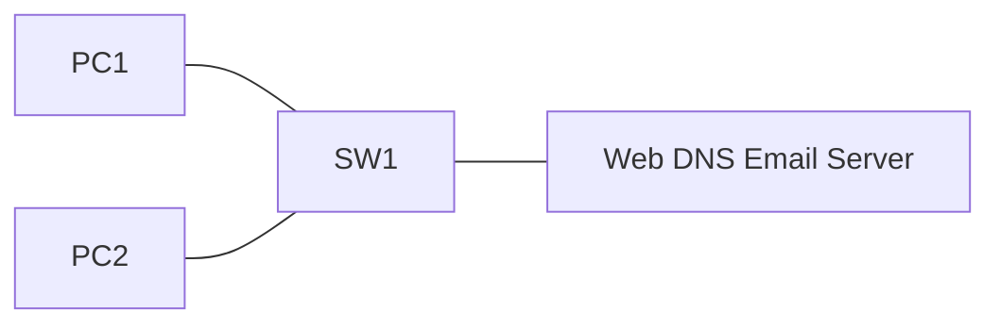

# 24 - HTTP, HTTPS, SMTP, POP3, and IMAP Services - Step by Step

> [!info] Outcome
> Configure Packet Tracer web and email services, publish a web page, create user mailboxes, and test name-based client access.

> [!warning] Interface-name check
> The examples use Cisco 2911/1941 router interfaces such as `GigabitEthernet0/0` and Cisco 2960 switch ports such as `FastEthernet0/1`. Check the labels on your Packet Tracer device and substitute the actual interface name when it differs.

## 1. Packet Tracer Support

**Partial**

## 2. Example Topology



### Devices and Cabling

| From | To | Cable / Link |
|---|---|---|
| PC1 | SW1 F0/1 | Copper straight-through |
| PC2 | SW1 F0/2 | Copper straight-through |
| Server | SW1 F0/24 | Copper straight-through |

## 3. Addressing Plan

| Device | Interface | Address / Setting | Default Gateway |
|---|---|---|---|
| Server | FastEthernet0 | 192.168.50.10 /24 | 192.168.50.1 |
| PC1 | FastEthernet0 | 192.168.50.20 /24 | 192.168.50.1 |
| PC2 | FastEthernet0 | 192.168.50.30 /24 | 192.168.50.1 |

## 4. Before You Configure

1. Place and rename every device exactly as shown.
2. Connect the interfaces in the cabling table.
3. Wait for links to become active before troubleshooting Layer 3.
4. Erase or inspect old lab configuration so it does not conflict with this example.

## 5. Step-by-Step Configuration

### Step 1 — Build the topology

Place the listed devices, rename them, and make each connection shown above.

### Step 2 — Confirm the addressing plan

Check that every address is unique, belongs to the stated subnet, and uses the correct mask or prefix length.

### Step 3 — Open each device

For IOS devices, select **CLI** and press Enter. For PCs and servers, use the named Packet Tracer desktop or services panel.

### Step 4 — Configure Gateway R1

Open **Gateway R1 → CLI**, press Enter, and enter the following commands exactly.

```cisco
enable
configure terminal
hostname R1
interface gigabitEthernet0/0
 ip address 192.168.50.1 255.255.255.0
 no shutdown
end
copy running-config startup-config
```

### Step 5 — Configure server addressing

Set `192.168.50.10/24`, gateway `192.168.50.1`, DNS `192.168.50.10`.
### Step 6 — Enable DNS and web

Under **Services**, enable DNS and add `www.campus.lab` → `192.168.50.10`. Enable HTTP and HTTPS; edit `index.html` with a classroom test page.
### Step 7 — Enable email

Open **Services → EMAIL**, enable SMTP and POP3, set domain `campus.lab`, then add users `alice` and `bob` with classroom passwords.
### Step 8 — Configure clients

Give PC1 and PC2 their table addresses and DNS `192.168.50.10`. In **Desktop → Email**, configure Alice and Bob with incoming and outgoing server `192.168.50.10`.

## 6. Complete Device Configurations

Use these blocks when rebuilding the example from an empty Packet Tracer file. Each block belongs only to the device named above it.

### Gateway R1

```cisco
enable
configure terminal
hostname R1
interface gigabitEthernet0/0
 ip address 192.168.50.1 255.255.255.0
 no shutdown
end
copy running-config startup-config
```

## 7. Key Configuration Logic

- Configure physical or logical interfaces before depending on a protocol that uses them.
- Use `no shutdown` on routed interfaces and switched virtual interfaces when required.
- Keep VLAN IDs, IP networks, masks, wildcard masks, and default gateways consistent with the addressing table.
- Save the configuration only after verification succeeds.

> [!note] Teaching note
> Packet Tracer commonly simulates SMTP and POP3 but does not fully model modern TLS, certificate validation, or IMAP behaviour. Use a real mail lab for those features.

## 8. Verification Commands

Run the commands relevant to the device and compare the result with the addressing and topology tables.

- `ping 192.168.50.10`
- `nslookup www.campus.lab`
- `Browser: http://www.campus.lab`
- `PC email Send/Receive`

## 9. Testing Matrix

| Test | Source | Destination / Check | Expected Result |
|---|---|---|---|
| Web by IP | PC1 | http://192.168.50.10 | Page opens |
| Web by name | PC1 | http://www.campus.lab | DNS resolves and page opens |
| Email | alice@campus.lab | bob@campus.lab | Message is received |

## 10. Troubleshooting

| Symptom | Likely Cause | Check or Fix |
|---|---|---|
| Web name fails | DNS record or client DNS address wrong | Point both clients to 192.168.50.10 and verify A record |
| Mail fails | Domain, account, or incoming/outgoing server mismatch | Use campus.lab and server 192.168.50.10 consistently |

## 11. Save and Finish

On every IOS device whose tests pass:

```cisco
copy running-config startup-config
```

Then save the Packet Tracer activity file with a descriptive version number.

## 12. Related Configuration Notes

- [[19 - DHCP - Dynamic Host Configuration Protocol on a Cisco Router - Step by Step]]
- [[20 - Central DHCP Server with DHCP Relay - Step by Step]]
- [[21 - DNS - Domain Name System Server - Step by Step]]
- [[22 - NTP - Network Time Protocol - Step by Step]]

Return to [[Configuration Library Dashboard]].
