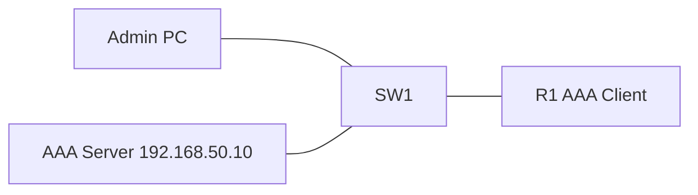

# 27 - RADIUS and TACACS+ Central AAA - Step by Step

> [!info] Outcome
> Authenticate SSH administrators against a central Remote Authentication Dial-In User Service (RADIUS) or Terminal Access Controller Access-Control System Plus (TACACS+) server with a local fallback.

> [!warning] Interface-name check
> The examples use Cisco 2911/1941 router interfaces such as `GigabitEthernet0/0` and Cisco 2960 switch ports such as `FastEthernet0/1`. Check the labels on your Packet Tracer device and substitute the actual interface name when it differs.

## 1. Packet Tracer Support

**Partial**

## 2. Example Topology



### Devices and Cabling

| From | To | Cable / Link |
|---|---|---|
| Admin PC | SW1 F0/1 | Copper straight-through |
| AAA Server | SW1 F0/2 | Copper straight-through |
| R1 G0/0 | SW1 G0/1 | Copper straight-through |

## 3. Addressing Plan

| Device | Interface | Address / Setting | Default Gateway |
|---|---|---|---|
| R1 | G0/0 | 192.168.50.1 /24 | — |
| AAA Server | FastEthernet0 | 192.168.50.10 /24 | 192.168.50.1 |
| Admin PC | FastEthernet0 | 192.168.50.20 /24 | 192.168.50.1 |

## 4. Before You Configure

1. Place and rename every device exactly as shown.
2. Connect the interfaces in the cabling table.
3. Wait for links to become active before troubleshooting Layer 3.
4. Erase or inspect old lab configuration so it does not conflict with this example.

## 5. Step-by-Step Configuration

### Step 1 — Build the topology

Place the listed devices, rename them, and make each connection shown above.

### Step 2 — Confirm the addressing plan

Check that every address is unique, belongs to the stated subnet, and uses the correct mask or prefix length.

### Step 3 — Open each device

For IOS devices, select **CLI** and press Enter. For PCs and servers, use the named Packet Tracer desktop or services panel.

### Step 4 — Configure R1 — RADIUS Example

Open **R1 — RADIUS Example → CLI**, press Enter, and enter the following commands exactly.

```cisco
enable
configure terminal
hostname R1
ip domain-name campus.lab
username emergency privilege 15 secret LocalFallback!23
aaa new-model
radius-server host 192.168.50.10 auth-port 1812 acct-port 1813 key RadiusKey123
aaa authentication login VTY-AUTH group radius local
interface gigabitEthernet0/0
 ip address 192.168.50.1 255.255.255.0
 no shutdown
exit
crypto key generate rsa modulus 1024
ip ssh version 2
line vty 0 4
 login authentication VTY-AUTH
 transport input ssh
end
copy running-config startup-config
```
### Step 5 — Configure R1 — TACACS+ Alternative

Open **R1 — TACACS+ Alternative → CLI**, press Enter, and enter the following commands exactly.

```cisco
enable
configure terminal
tacacs-server host 192.168.50.10 key TacacsKey123
aaa authentication login VTY-AUTH group tacacs+ local
aaa authorization exec default group tacacs+ local
aaa accounting exec default start-stop group tacacs+
end
copy running-config startup-config
```

### Step 6 — Configure the AAA server

Set `192.168.50.10/24`, gateway `192.168.50.1`. Open **Services → AAA**, enable the service, add R1 as a network client with the same shared secret, and create an administrator account.
### Step 7 — Test centrally and locally

From Admin PC, test the central account first. Then temporarily disable the AAA service and verify the `emergency` local fallback.

## 6. Complete Device Configurations

Use these blocks when rebuilding the example from an empty Packet Tracer file. Each block belongs only to the device named above it.

### R1 — RADIUS Example

```cisco
enable
configure terminal
hostname R1
ip domain-name campus.lab
username emergency privilege 15 secret LocalFallback!23
aaa new-model
radius-server host 192.168.50.10 auth-port 1812 acct-port 1813 key RadiusKey123
aaa authentication login VTY-AUTH group radius local
interface gigabitEthernet0/0
 ip address 192.168.50.1 255.255.255.0
 no shutdown
exit
crypto key generate rsa modulus 1024
ip ssh version 2
line vty 0 4
 login authentication VTY-AUTH
 transport input ssh
end
copy running-config startup-config
```
### R1 — TACACS+ Alternative

```cisco
enable
configure terminal
tacacs-server host 192.168.50.10 key TacacsKey123
aaa authentication login VTY-AUTH group tacacs+ local
aaa authorization exec default group tacacs+ local
aaa accounting exec default start-stop group tacacs+
end
copy running-config startup-config
```

## 7. Key Configuration Logic

- Configure physical or logical interfaces before depending on a protocol that uses them.
- Use `no shutdown` on routed interfaces and switched virtual interfaces when required.
- Keep VLAN IDs, IP networks, masks, wildcard masks, and default gateways consistent with the addressing table.
- Save the configuration only after verification succeeds.

> [!note] Teaching note
> Packet Tracer command syntax and TACACS+ feature depth vary by IOS image. Modern IOS XE commonly uses named `radius server` and `tacacs server` objects; validate against the target platform.

## 8. Verification Commands

Run the commands relevant to the device and compare the result with the addressing and topology tables.

- `show running-config | section aaa`
- `show radius statistics`
- `debug radius authentication`
- `debug tacacs authentication`

## 9. Testing Matrix

| Test | Source | Destination / Check | Expected Result |
|---|---|---|---|
| Central login | Admin PC | SSH with server account | Login accepted by chosen AAA protocol |
| Fallback | Admin PC | SSH as emergency while server is unavailable | Local fallback succeeds |

## 10. Troubleshooting

| Symptom | Likely Cause | Check or Fix |
|---|---|---|
| Server rejects client | Router client entry, shared secret, or protocol differs | Match the router IP and shared secret on both sides |
| No response | Routing, firewall, or Packet Tracer service limitation | Ping server and verify the selected AAA service is enabled |

## 11. Save and Finish

On every IOS device whose tests pass:

```cisco
copy running-config startup-config
```

Then save the Packet Tracer activity file with a descriptive version number.

## 12. Related Configuration Notes

- [[25 - SSH - Secure Shell Remote Management - Step by Step]]
- [[26 - AAA - Authentication, Authorization, and Accounting with Local Users - Step by Step]]
- [[28 - Standard IPv4 ACL - Access Control List - Step by Step]]
- [[29 - Extended and Named IPv4 ACL - Access Control List - Step by Step]]

Return to [[Configuration Library Dashboard]].
