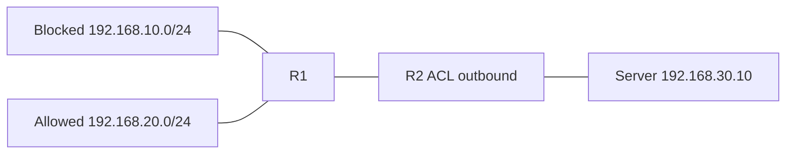

# 28 - Standard IPv4 ACL - Access Control List - Step by Step

> [!info] Outcome
> Use a standard IPv4 Access Control List (ACL) near the destination to block one source subnet while permitting all other sources.

> [!warning] Interface-name check
> The examples use Cisco 2911/1941 router interfaces such as `GigabitEthernet0/0` and Cisco 2960 switch ports such as `FastEthernet0/1`. Check the labels on your Packet Tracer device and substitute the actual interface name when it differs.

## 1. Packet Tracer Support

**Yes**

## 2. Example Topology



### Devices and Cabling

| From | To | Cable / Link |
|---|---|---|
| LAN10 and LAN20 PCs | R1 access interfaces through switches | Copper straight-through |
| R1 G0/2 | R2 G0/1 | Copper crossover or Automatic |
| R2 G0/0 | Server switch | Copper straight-through |

## 3. Addressing Plan

| Device | Interface | Address / Setting | Default Gateway |
|---|---|---|---|
| R1 | G0/0 | 192.168.10.1 /24 | — |
| R1 | G0/1 | 192.168.20.1 /24 | — |
| R1 | G0/2 | 10.0.12.1 /30 | — |
| R2 | G0/1 | 10.0.12.2 /30 | — |
| R2 | G0/0 | 192.168.30.1 /24 | — |
| Server | FastEthernet0 | 192.168.30.10 /24 | 192.168.30.1 |

## 4. Before You Configure

1. Place and rename every device exactly as shown.
2. Connect the interfaces in the cabling table.
3. Wait for links to become active before troubleshooting Layer 3.
4. Erase or inspect old lab configuration so it does not conflict with this example.

## 5. Step-by-Step Configuration

### Step 1 — Build the topology

Place the listed devices, rename them, and make each connection shown above.

### Step 2 — Confirm the addressing plan

Check that every address is unique, belongs to the stated subnet, and uses the correct mask or prefix length.

### Step 3 — Open each device

For IOS devices, select **CLI** and press Enter. For PCs and servers, use the named Packet Tracer desktop or services panel.

### Step 4 — Configure R1

Open **R1 → CLI**, press Enter, and enter the following commands exactly.

```cisco
enable
configure terminal
hostname R1
interface gigabitEthernet0/0
 ip address 192.168.10.1 255.255.255.0
 no shutdown
interface gigabitEthernet0/1
 ip address 192.168.20.1 255.255.255.0
 no shutdown
interface gigabitEthernet0/2
 ip address 10.0.12.1 255.255.255.252
 no shutdown
exit
ip route 192.168.30.0 255.255.255.0 10.0.12.2
end
copy running-config startup-config
```
### Step 5 — Configure R2

Open **R2 → CLI**, press Enter, and enter the following commands exactly.

```cisco
enable
configure terminal
hostname R2
interface gigabitEthernet0/1
 ip address 10.0.12.2 255.255.255.252
 no shutdown
interface gigabitEthernet0/0
 ip address 192.168.30.1 255.255.255.0
 ip access-group BLOCK-LAN10 out
 no shutdown
exit
ip route 192.168.10.0 255.255.255.0 10.0.12.1
ip route 192.168.20.0 255.255.255.0 10.0.12.1
ip access-list standard BLOCK-LAN10
 deny 192.168.10.0 0.0.0.255
 permit any
end
copy running-config startup-config
```


## 6. Complete Device Configurations

Use these blocks when rebuilding the example from an empty Packet Tracer file. Each block belongs only to the device named above it.

### R1

```cisco
enable
configure terminal
hostname R1
interface gigabitEthernet0/0
 ip address 192.168.10.1 255.255.255.0
 no shutdown
interface gigabitEthernet0/1
 ip address 192.168.20.1 255.255.255.0
 no shutdown
interface gigabitEthernet0/2
 ip address 10.0.12.1 255.255.255.252
 no shutdown
exit
ip route 192.168.30.0 255.255.255.0 10.0.12.2
end
copy running-config startup-config
```
### R2

```cisco
enable
configure terminal
hostname R2
interface gigabitEthernet0/1
 ip address 10.0.12.2 255.255.255.252
 no shutdown
interface gigabitEthernet0/0
 ip address 192.168.30.1 255.255.255.0
 ip access-group BLOCK-LAN10 out
 no shutdown
exit
ip route 192.168.10.0 255.255.255.0 10.0.12.1
ip route 192.168.20.0 255.255.255.0 10.0.12.1
ip access-list standard BLOCK-LAN10
 deny 192.168.10.0 0.0.0.255
 permit any
end
copy running-config startup-config
```

## 7. Key Configuration Logic

- Configure physical or logical interfaces before depending on a protocol that uses them.
- Use `no shutdown` on routed interfaces and switched virtual interfaces when required.
- Keep VLAN IDs, IP networks, masks, wildcard masks, and default gateways consistent with the addressing table.
- Save the configuration only after verification succeeds.

> [!note] Teaching note
> Configure and verify routing before applying the ACL; otherwise a routing failure can look like an ACL failure.

## 8. Verification Commands

Run the commands relevant to the device and compare the result with the addressing and topology tables.

- `show access-lists`
- `show ip interface gigabitEthernet0/0`
- `show ip route`
- `ping`

## 9. Testing Matrix

| Test | Source | Destination / Check | Expected Result |
|---|---|---|---|
| Blocked source | LAN10 PC | 192.168.30.10 | Fails |
| Allowed source | LAN20 PC | 192.168.30.10 | Succeeds |
| Counters | R2 | show access-lists | Deny and permit counters increase |

## 10. Troubleshooting

| Symptom | Likely Cause | Check or Fix |
|---|---|---|
| Everyone blocked | permit any missing | Add explicit permit any before the implicit deny |
| ACL has no effect | Applied to wrong interface/direction | Use show ip interface and place standard ACL near destination |

## 11. Save and Finish

On every IOS device whose tests pass:

```cisco
copy running-config startup-config
```

Then save the Packet Tracer activity file with a descriptive version number.

## 12. Related Configuration Notes

- [[25 - SSH - Secure Shell Remote Management - Step by Step]]
- [[26 - AAA - Authentication, Authorization, and Accounting with Local Users - Step by Step]]
- [[27 - RADIUS and TACACS+ Central AAA - Step by Step]]
- [[29 - Extended and Named IPv4 ACL - Access Control List - Step by Step]]

Return to [[Configuration Library Dashboard]].
