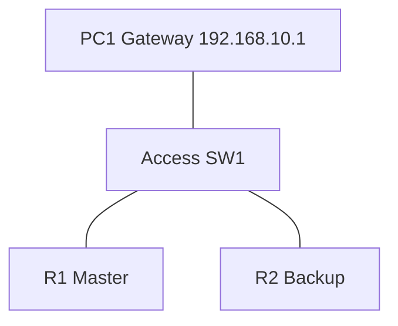

# 32 - VRRP - Virtual Router Redundancy Protocol - Step by Step

> [!info] Outcome
> Configure Virtual Router Redundancy Protocol (VRRP) with a master, backup, virtual address, and preemption where the selected IOS image supports it.

> [!warning] Interface-name check
> The examples use Cisco 2911/1941 router interfaces such as `GigabitEthernet0/0` and Cisco 2960 switch ports such as `FastEthernet0/1`. Check the labels on your Packet Tracer device and substitute the actual interface name when it differs.

## 1. Packet Tracer Support

**Partial**

## 2. Example Topology



### Devices and Cabling

| From | To | Cable / Link |
|---|---|---|
| PC1 | SW1 F0/1 | Copper straight-through |
| SW1 G0/1 | R1 G0/0 | Copper straight-through |
| SW1 G0/2 | R2 G0/0 | Copper straight-through |

## 3. Addressing Plan

| Device | Interface | Address / Setting | Default Gateway |
|---|---|---|---|
| Virtual Router | VRRP group 10 | 192.168.10.1 /24 | — |
| R1 | G0/0 | 192.168.10.2 /24 | — |
| R2 | G0/0 | 192.168.10.3 /24 | — |
| PC1 | FastEthernet0 | 192.168.10.10 /24 | 192.168.10.1 |

## 4. Before You Configure

1. Place and rename every device exactly as shown.
2. Connect the interfaces in the cabling table.
3. Wait for links to become active before troubleshooting Layer 3.
4. Erase or inspect old lab configuration so it does not conflict with this example.

## 5. Step-by-Step Configuration

### Step 1 — Build the topology

Place the listed devices, rename them, and make each connection shown above.

### Step 2 — Confirm the addressing plan

Check that every address is unique, belongs to the stated subnet, and uses the correct mask or prefix length.

### Step 3 — Open each device

For IOS devices, select **CLI** and press Enter. For PCs and servers, use the named Packet Tracer desktop or services panel.

### Step 4 — Configure R1

Open **R1 → CLI**, press Enter, and enter the following commands exactly.

```cisco
enable
configure terminal
hostname R1
interface gigabitEthernet0/0
 ip address 192.168.10.2 255.255.255.0
 vrrp 10 ip 192.168.10.1
 vrrp 10 priority 110
 vrrp 10 preempt
 no shutdown
end
copy running-config startup-config
```
### Step 5 — Configure R2

Open **R2 → CLI**, press Enter, and enter the following commands exactly.

```cisco
enable
configure terminal
hostname R2
interface gigabitEthernet0/0
 ip address 192.168.10.3 255.255.255.0
 vrrp 10 ip 192.168.10.1
 vrrp 10 priority 100
 vrrp 10 preempt
 no shutdown
end
copy running-config startup-config
```

### Step 6 — Configure PC1

Use `192.168.10.10/24` and virtual gateway `192.168.10.1`.

## 6. Complete Device Configurations

Use these blocks when rebuilding the example from an empty Packet Tracer file. Each block belongs only to the device named above it.

### R1

```cisco
enable
configure terminal
hostname R1
interface gigabitEthernet0/0
 ip address 192.168.10.2 255.255.255.0
 vrrp 10 ip 192.168.10.1
 vrrp 10 priority 110
 vrrp 10 preempt
 no shutdown
end
copy running-config startup-config
```
### R2

```cisco
enable
configure terminal
hostname R2
interface gigabitEthernet0/0
 ip address 192.168.10.3 255.255.255.0
 vrrp 10 ip 192.168.10.1
 vrrp 10 priority 100
 vrrp 10 preempt
 no shutdown
end
copy running-config startup-config
```

## 7. Key Configuration Logic

- Configure physical or logical interfaces before depending on a protocol that uses them.
- Use `no shutdown` on routed interfaces and switched virtual interfaces when required.
- Keep VLAN IDs, IP networks, masks, wildcard masks, and default gateways consistent with the addressing table.
- Save the configuration only after verification succeeds.

> [!note] Teaching note
> Packet Tracer VRRP support is image-dependent. This note remains useful for IOS labs in Cisco Modeling Labs, GNS3, EVE-NG, or real equipment.

## 8. Verification Commands

Run the commands relevant to the device and compare the result with the addressing and topology tables.

- `show vrrp brief`
- `show vrrp`
- `show ip interface brief`
- `ping 192.168.10.1`

## 9. Testing Matrix

| Test | Source | Destination / Check | Expected Result |
|---|---|---|---|
| Initial roles | R1/R2 | show vrrp brief | R1 master; R2 backup |
| Gateway | PC1 | 192.168.10.1 | Success |
| Failover | R1 | Shutdown G0/0 | R2 becomes master |

## 10. Troubleshooting

| Symptom | Likely Cause | Check or Fix |
|---|---|---|
| vrrp command unavailable | Packet Tracer IOS image lacks support | Use HSRP in Packet Tracer or test VRRP in CML/GNS3/EVE-NG |
| No shared state | Different group or virtual IP | Match group 10 and 192.168.10.1 |

## 11. Save and Finish

On every IOS device whose tests pass:

```cisco
copy running-config startup-config
```

Then save the Packet Tracer activity file with a descriptive version number.

## 12. Related Configuration Notes

- [[31 - HSRP - Hot Standby Router Protocol with Tracking - Step by Step]]
- [[32A - GLBP - Gateway Load Balancing Protocol - Step by Step]]

Return to [[Configuration Library Dashboard]].
