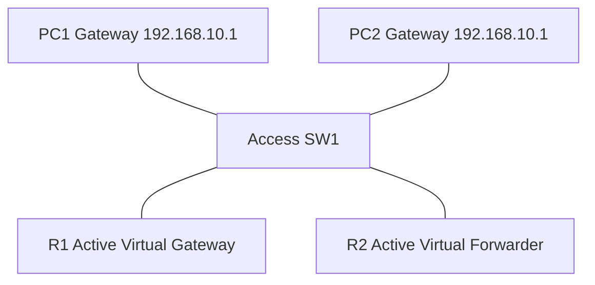

# 32A - GLBP - Gateway Load Balancing Protocol - Step by Step

> [!info] Outcome
> Configure Gateway Load Balancing Protocol (GLBP) so two routers provide one resilient virtual gateway while sharing client forwarding responsibility.

> [!warning] Interface-name check
> The examples use Cisco 2911/1941 router interfaces such as `GigabitEthernet0/0` and Cisco 2960 switch ports such as `FastEthernet0/1`. Check the labels on your Packet Tracer device and substitute the actual interface name when it differs.

## 1. Packet Tracer Support

**Partial**

## 2. Example Topology



### Devices and Cabling

| From | To | Cable / Link |
|---|---|---|
| PC1/PC2 | SW1 access ports | Copper straight-through |
| SW1 G0/1 | R1 G0/0 | Copper straight-through |
| SW1 G0/2 | R2 G0/0 | Copper straight-through |

## 3. Addressing Plan

| Device | Interface | Address / Setting | Default Gateway |
|---|---|---|---|
| GLBP Virtual Gateway | Group 10 | 192.168.10.1 /24 | — |
| R1 | G0/0 | 192.168.10.2 /24 | — |
| R2 | G0/0 | 192.168.10.3 /24 | — |
| PC1 | FastEthernet0 | 192.168.10.10 /24 | 192.168.10.1 |
| PC2 | FastEthernet0 | 192.168.10.20 /24 | 192.168.10.1 |

## 4. Before You Configure

1. Place and rename every device exactly as shown.
2. Connect the interfaces in the cabling table.
3. Wait for links to become active before troubleshooting Layer 3.
4. Erase or inspect old lab configuration so it does not conflict with this example.

## 5. Step-by-Step Configuration

### Step 1 — Build the topology

Place the listed devices, rename them, and make each connection shown above.

### Step 2 — Confirm the addressing plan

Check that every address is unique, belongs to the stated subnet, and uses the correct mask or prefix length.

### Step 3 — Open each device

For IOS devices, select **CLI** and press Enter. For PCs and servers, use the named Packet Tracer desktop or services panel.

### Step 4 — Configure R1

Open **R1 → CLI**, press Enter, and enter the following commands exactly.

```cisco
enable
configure terminal
hostname R1
interface gigabitEthernet0/0
 ip address 192.168.10.2 255.255.255.0
 glbp 10 ip 192.168.10.1
 glbp 10 priority 110
 glbp 10 preempt
 glbp 10 load-balancing round-robin
 no shutdown
end
copy running-config startup-config
```
### Step 5 — Configure R2

Open **R2 → CLI**, press Enter, and enter the following commands exactly.

```cisco
enable
configure terminal
hostname R2
interface gigabitEthernet0/0
 ip address 192.168.10.3 255.255.255.0
 glbp 10 ip 192.168.10.1
 glbp 10 priority 100
 glbp 10 preempt
 glbp 10 load-balancing round-robin
 no shutdown
end
copy running-config startup-config
```

### Step 6 — Configure both PCs

Assign the table addresses and use the GLBP virtual gateway `192.168.10.1`.

## 6. Complete Device Configurations

Use these blocks when rebuilding the example from an empty Packet Tracer file. Each block belongs only to the device named above it.

### R1

```cisco
enable
configure terminal
hostname R1
interface gigabitEthernet0/0
 ip address 192.168.10.2 255.255.255.0
 glbp 10 ip 192.168.10.1
 glbp 10 priority 110
 glbp 10 preempt
 glbp 10 load-balancing round-robin
 no shutdown
end
copy running-config startup-config
```
### R2

```cisco
enable
configure terminal
hostname R2
interface gigabitEthernet0/0
 ip address 192.168.10.3 255.255.255.0
 glbp 10 ip 192.168.10.1
 glbp 10 priority 100
 glbp 10 preempt
 glbp 10 load-balancing round-robin
 no shutdown
end
copy running-config startup-config
```

## 7. Key Configuration Logic

- Configure physical or logical interfaces before depending on a protocol that uses them.
- Use `no shutdown` on routed interfaces and switched virtual interfaces when required.
- Keep VLAN IDs, IP networks, masks, wildcard masks, and default gateways consistent with the addressing table.
- Save the configuration only after verification succeeds.

> [!note] Teaching note
> Unlike HSRP or VRRP, GLBP can distribute host forwarding across multiple active virtual forwarders. Simulator support is image-dependent.

## 8. Verification Commands

Run the commands relevant to the device and compare the result with the addressing and topology tables.

- `show glbp brief`
- `show glbp`
- `show arp`

## 9. Testing Matrix

| Test | Source | Destination / Check | Expected Result |
|---|---|---|---|
| Virtual gateway | PC1 and PC2 | 192.168.10.1 | Success |
| Gateway role | R1/R2 | show glbp brief | One active virtual gateway and multiple forwarders |
| Failover | PC continuous ping | Shut R1 G0/0 | R2 maintains the virtual gateway |

## 10. Troubleshooting

| Symptom | Likely Cause | Check or Fix |
|---|---|---|
| glbp command unavailable | Packet Tracer IOS image lacks GLBP | Use CML, GNS3, EVE-NG, or real IOS |
| Only one router participates | Group, subnet, or virtual IP mismatch | Match group 10 and the virtual address on both routers |

## 11. Save and Finish

On every IOS device whose tests pass:

```cisco
copy running-config startup-config
```

Then save the Packet Tracer activity file with a descriptive version number.

## 12. Related Configuration Notes

- [[31 - HSRP - Hot Standby Router Protocol with Tracking - Step by Step]]
- [[32 - VRRP - Virtual Router Redundancy Protocol - Step by Step]]

Return to [[Configuration Library Dashboard]].
