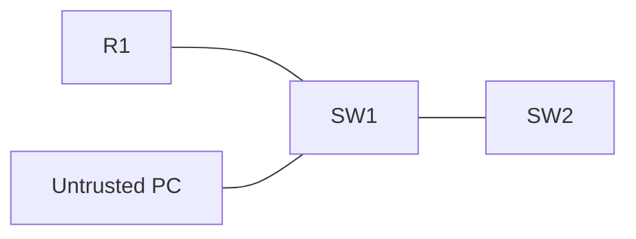

# 36 - CDP and LLDP - Cisco and Link Layer Discovery Protocols - Step by Step

> [!info] Outcome
> Enable and verify Cisco Discovery Protocol (CDP) and Link Layer Discovery Protocol (LLDP), then disable discovery on an untrusted edge port.

> [!warning] Interface-name check
> The examples use Cisco 2911/1941 router interfaces such as `GigabitEthernet0/0` and Cisco 2960 switch ports such as `FastEthernet0/1`. Check the labels on your Packet Tracer device and substitute the actual interface name when it differs.

## 1. Packet Tracer Support

**Partial**

## 2. Example Topology



### Devices and Cabling

| From | To | Cable / Link |
|---|---|---|
| R1 G0/0 | SW1 G0/1 | Copper straight-through |
| SW1 G0/2 | SW2 G0/1 | Copper crossover or Automatic |
| PC1 | SW1 F0/1 | Copper straight-through |

## 3. Addressing Plan

| Device | Interface | Address / Setting | Default Gateway |
|---|---|---|---|
| R1 | G0/0 | 192.168.99.1 /24 | — |
| SW1 | VLAN 99 | 192.168.99.2 /24 | 192.168.99.1 |
| SW2 | VLAN 99 | 192.168.99.3 /24 | 192.168.99.1 |

## 4. Before You Configure

1. Place and rename every device exactly as shown.
2. Connect the interfaces in the cabling table.
3. Wait for links to become active before troubleshooting Layer 3.
4. Erase or inspect old lab configuration so it does not conflict with this example.

## 5. Step-by-Step Configuration

### Step 1 — Build the topology

Place the listed devices, rename them, and make each connection shown above.

### Step 2 — Confirm the addressing plan

Check that every address is unique, belongs to the stated subnet, and uses the correct mask or prefix length.

### Step 3 — Open each device

For IOS devices, select **CLI** and press Enter. For PCs and servers, use the named Packet Tracer desktop or services panel.

### Step 4 — Configure R1

Open **R1 → CLI**, press Enter, and enter the following commands exactly.

```cisco
enable
configure terminal
hostname R1
cdp run
lldp run
interface gigabitEthernet0/0
 ip address 192.168.99.1 255.255.255.0
 no shutdown
end
copy running-config startup-config
```
### Step 5 — Configure SW1

Open **SW1 → CLI**, press Enter, and enter the following commands exactly.

```cisco
enable
configure terminal
hostname SW1
cdp run
lldp run
vlan 99
interface vlan 99
 ip address 192.168.99.2 255.255.255.0
 no shutdown
interface fastEthernet0/1
 no cdp enable
 no lldp transmit
 no lldp receive
end
copy running-config startup-config
```
### Step 6 — Configure SW2

Open **SW2 → CLI**, press Enter, and enter the following commands exactly.

```cisco
enable
configure terminal
hostname SW2
cdp run
lldp run
vlan 99
interface vlan 99
 ip address 192.168.99.3 255.255.255.0
 no shutdown
end
copy running-config startup-config
```


## 6. Complete Device Configurations

Use these blocks when rebuilding the example from an empty Packet Tracer file. Each block belongs only to the device named above it.

### R1

```cisco
enable
configure terminal
hostname R1
cdp run
lldp run
interface gigabitEthernet0/0
 ip address 192.168.99.1 255.255.255.0
 no shutdown
end
copy running-config startup-config
```
### SW1

```cisco
enable
configure terminal
hostname SW1
cdp run
lldp run
vlan 99
interface vlan 99
 ip address 192.168.99.2 255.255.255.0
 no shutdown
interface fastEthernet0/1
 no cdp enable
 no lldp transmit
 no lldp receive
end
copy running-config startup-config
```
### SW2

```cisco
enable
configure terminal
hostname SW2
cdp run
lldp run
vlan 99
interface vlan 99
 ip address 192.168.99.3 255.255.255.0
 no shutdown
end
copy running-config startup-config
```

## 7. Key Configuration Logic

- Configure physical or logical interfaces before depending on a protocol that uses them.
- Use `no shutdown` on routed interfaces and switched virtual interfaces when required.
- Keep VLAN IDs, IP networks, masks, wildcard masks, and default gateways consistent with the addressing table.
- Save the configuration only after verification succeeds.

> [!note] Teaching note
> CDP is Cisco proprietary; LLDP is the multi-vendor IEEE 802.1AB alternative.

## 8. Verification Commands

Run the commands relevant to the device and compare the result with the addressing and topology tables.

- `show cdp neighbors`
- `show cdp neighbors detail`
- `show lldp neighbors`
- `show lldp neighbors detail`

## 9. Testing Matrix

| Test | Source | Destination / Check | Expected Result |
|---|---|---|---|
| Cisco discovery | SW1 | R1 and SW2 | Neighbors appear in CDP table |
| Open discovery | SW1 | Connected LLDP-capable devices | Neighbors appear where supported |
| Edge privacy | SW1 | F0/1 | No discovery advertisements sent or accepted |

## 10. Troubleshooting

| Symptom | Likely Cause | Check or Fix |
|---|---|---|
| No LLDP command | Packet Tracer switch image limitation | Use CDP in Packet Tracer or test LLDP on supported IOS |
| Neighbor missing | Protocol disabled or interface down | Check global and per-interface discovery state |

## 11. Save and Finish

On every IOS device whose tests pass:

```cisco
copy running-config startup-config
```

Then save the Packet Tracer activity file with a descriptive version number.

## 12. Related Configuration Notes

- [[33 - SNMPv2c - Simple Network Management Protocol Version 2c - Step by Step]]
- [[34 - SNMPv3 - Simple Network Management Protocol Version 3 - Step by Step]]
- [[35 - Syslog Central Logging - Step by Step]]

Return to [[Configuration Library Dashboard]].
