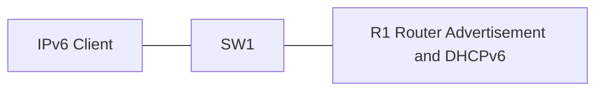

# 42 - SLAAC - Stateless Address Autoconfiguration with DHCPv6 - Step by Step

> [!info] Outcome
> Configure Stateless Address Autoconfiguration (SLAAC), stateless Dynamic Host Configuration Protocol for IPv6 (DHCPv6), and stateful DHCPv6 as clearly separated client-addressing alternatives.

> [!warning] Interface-name check
> The examples use Cisco 2911/1941 router interfaces such as `GigabitEthernet0/0` and Cisco 2960 switch ports such as `FastEthernet0/1`. Check the labels on your Packet Tracer device and substitute the actual interface name when it differs.

## 1. Packet Tracer Support

**Partial**

## 2. Example Topology



### Devices and Cabling

| From | To | Cable / Link |
|---|---|---|
| PC1 | SW1 F0/1 | Copper straight-through |
| SW1 G0/1 | R1 G0/0 | Copper straight-through |

## 3. Addressing Plan

| Device | Interface | Address / Setting | Default Gateway |
|---|---|---|---|
| R1 | G0/0 | 2001:DB8:10::1/64; FE80::1 | — |
| PC1 | FastEthernet0 | SLAAC or DHCPv6 | FE80::1 learned from Router Advertisement |

## 4. Before You Configure

1. Place and rename every device exactly as shown.
2. Connect the interfaces in the cabling table.
3. Wait for links to become active before troubleshooting Layer 3.
4. Erase or inspect old lab configuration so it does not conflict with this example.

## 5. Step-by-Step Configuration

### Step 1 — Build the topology

Place the listed devices, rename them, and make each connection shown above.

### Step 2 — Confirm the addressing plan

Check that every address is unique, belongs to the stated subnet, and uses the correct mask or prefix length.

### Step 3 — Open each device

For IOS devices, select **CLI** and press Enter. For PCs and servers, use the named Packet Tracer desktop or services panel.

### Step 4 — Configure R1 — SLAAC Only

Open **R1 — SLAAC Only → CLI**, press Enter, and enter the following commands exactly.

```cisco
enable
configure terminal
hostname R1
ipv6 unicast-routing
interface gigabitEthernet0/0
 ipv6 address 2001:DB8:10::1/64
 ipv6 address FE80::1 link-local
 no shutdown
end
copy running-config startup-config
```
### Step 5 — Configure R1 — Stateless DHCPv6 Alternative

Open **R1 — Stateless DHCPv6 Alternative → CLI**, press Enter, and enter the following commands exactly.

```cisco
enable
configure terminal
ipv6 dhcp pool STATELESS-V6
 dns-server 2001:DB8:50::53
 domain-name campus.lab
exit
interface gigabitEthernet0/0
 ipv6 nd other-config-flag
 ipv6 dhcp server STATELESS-V6
end
copy running-config startup-config
```
### Step 6 — Configure R1 — Stateful DHCPv6 Alternative

Open **R1 — Stateful DHCPv6 Alternative → CLI**, press Enter, and enter the following commands exactly.

```cisco
enable
configure terminal
ipv6 local pool V6-PREFIX 2001:DB8:10::/64 64
ipv6 dhcp pool STATEFUL-V6
 address prefix 2001:DB8:10::/64
 dns-server 2001:DB8:50::53
 domain-name campus.lab
exit
interface gigabitEthernet0/0
 ipv6 nd managed-config-flag
 ipv6 dhcp server STATEFUL-V6
end
copy running-config startup-config
```

### Step 7 — Configure PC1

Select **IPv6 Auto Config** for SLAAC. For DHCPv6 alternatives, select the simulator's DHCPv6 option and renew after changing the router configuration.

## 6. Complete Device Configurations

Use these blocks when rebuilding the example from an empty Packet Tracer file. Each block belongs only to the device named above it.

### R1 — SLAAC Only

```cisco
enable
configure terminal
hostname R1
ipv6 unicast-routing
interface gigabitEthernet0/0
 ipv6 address 2001:DB8:10::1/64
 ipv6 address FE80::1 link-local
 no shutdown
end
copy running-config startup-config
```
### R1 — Stateless DHCPv6 Alternative

```cisco
enable
configure terminal
ipv6 dhcp pool STATELESS-V6
 dns-server 2001:DB8:50::53
 domain-name campus.lab
exit
interface gigabitEthernet0/0
 ipv6 nd other-config-flag
 ipv6 dhcp server STATELESS-V6
end
copy running-config startup-config
```
### R1 — Stateful DHCPv6 Alternative

```cisco
enable
configure terminal
ipv6 local pool V6-PREFIX 2001:DB8:10::/64 64
ipv6 dhcp pool STATEFUL-V6
 address prefix 2001:DB8:10::/64
 dns-server 2001:DB8:50::53
 domain-name campus.lab
exit
interface gigabitEthernet0/0
 ipv6 nd managed-config-flag
 ipv6 dhcp server STATEFUL-V6
end
copy running-config startup-config
```

## 7. Key Configuration Logic

- Configure physical or logical interfaces before depending on a protocol that uses them.
- Use `no shutdown` on routed interfaces and switched virtual interfaces when required.
- Keep VLAN IDs, IP networks, masks, wildcard masks, and default gateways consistent with the addressing table.
- Save the configuration only after verification succeeds.

> [!note] Teaching note
> Run one alternative at a time. Packet Tracer DHCPv6 client and server behaviour depends on the selected device image; use CML or real IOS if a command is missing.

## 8. Verification Commands

Run the commands relevant to the device and compare the result with the addressing and topology tables.

- `show ipv6 interface gigabitEthernet0/0`
- `show ipv6 dhcp pool`
- `show ipv6 dhcp binding`
- `show ipv6 neighbors`

## 9. Testing Matrix

| Test | Source | Destination / Check | Expected Result |
|---|---|---|---|
| SLAAC | PC1 | Automatic IPv6 | Global address in 2001:DB8:10::/64 and a link-local address |
| Router Advertisement | PC1 | Default route | Learns router through ICMPv6 RA |
| DHCPv6 option | PC1 | Stateless/stateful exercise | Receives supported DNS or address information |

## 10. Troubleshooting

| Symptom | Likely Cause | Check or Fix |
|---|---|---|
| No global address | IPv6 routing/interface/RA unavailable | Enable ipv6 unicast-routing and bring G0/0 up |
| DHCPv6 pool unused | Flag or interface pool binding missing | Apply the correct ND flag and ipv6 dhcp server command |

## 11. Save and Finish

On every IOS device whose tests pass:

```cisco
copy running-config startup-config
```

Then save the Packet Tracer activity file with a descriptive version number.

## 12. Related Configuration Notes

- [[41 - IPv6 - Internet Protocol Version 6 Addressing and Static Routing - Step by Step]]
- [[43 - OSPFv3 - Open Shortest Path First Version 3 for IPv6 - Step by Step]]

Return to [[Configuration Library Dashboard]].
