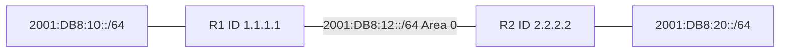

# 43 - OSPFv3 - Open Shortest Path First Version 3 for IPv6 - Step by Step

> [!info] Outcome
> Form an Open Shortest Path First Version 3 (OSPFv3) adjacency and exchange IPv6 LAN prefixes through area 0.

> [!warning] Interface-name check
> The examples use Cisco 2911/1941 router interfaces such as `GigabitEthernet0/0` and Cisco 2960 switch ports such as `FastEthernet0/1`. Check the labels on your Packet Tracer device and substitute the actual interface name when it differs.

## 1. Packet Tracer Support

**Yes**

## 2. Example Topology



### Devices and Cabling

| From | To | Cable / Link |
|---|---|---|
| PC1 | R1 G0/0 through switch | Copper straight-through |
| R1 G0/1 | R2 G0/1 | Copper crossover or Automatic |
| R2 G0/0 | PC2 through switch | Copper straight-through |

## 3. Addressing Plan

| Device | Interface | Address / Setting | Default Gateway |
|---|---|---|---|
| R1 | G0/0 | 2001:DB8:10::1/64 | — |
| R1 | G0/1 | 2001:DB8:12::1/64 | — |
| R2 | G0/1 | 2001:DB8:12::2/64 | — |
| R2 | G0/0 | 2001:DB8:20::1/64 | — |
| PC1 | FastEthernet0 | 2001:DB8:10::10/64 | 2001:DB8:10::1 |
| PC2 | FastEthernet0 | 2001:DB8:20::10/64 | 2001:DB8:20::1 |

## 4. Before You Configure

1. Place and rename every device exactly as shown.
2. Connect the interfaces in the cabling table.
3. Wait for links to become active before troubleshooting Layer 3.
4. Erase or inspect old lab configuration so it does not conflict with this example.

## 5. Step-by-Step Configuration

### Step 1 — Build the topology

Place the listed devices, rename them, and make each connection shown above.

### Step 2 — Confirm the addressing plan

Check that every address is unique, belongs to the stated subnet, and uses the correct mask or prefix length.

### Step 3 — Open each device

For IOS devices, select **CLI** and press Enter. For PCs and servers, use the named Packet Tracer desktop or services panel.

### Step 4 — Configure R1

Open **R1 → CLI**, press Enter, and enter the following commands exactly.

```cisco
enable
configure terminal
hostname R1
ipv6 unicast-routing
ipv6 router ospf 10
 router-id 1.1.1.1
exit
interface gigabitEthernet0/0
 ipv6 address 2001:DB8:10::1/64
 ipv6 ospf 10 area 0
 no shutdown
interface gigabitEthernet0/1
 ipv6 address 2001:DB8:12::1/64
 ipv6 ospf 10 area 0
 no shutdown
end
copy running-config startup-config
```
### Step 5 — Configure R2

Open **R2 → CLI**, press Enter, and enter the following commands exactly.

```cisco
enable
configure terminal
hostname R2
ipv6 unicast-routing
ipv6 router ospf 10
 router-id 2.2.2.2
exit
interface gigabitEthernet0/0
 ipv6 address 2001:DB8:20::1/64
 ipv6 ospf 10 area 0
 no shutdown
interface gigabitEthernet0/1
 ipv6 address 2001:DB8:12::2/64
 ipv6 ospf 10 area 0
 no shutdown
end
copy running-config startup-config
```

### Step 6 — Configure IPv6 hosts

Give each PC the static global address, `/64` prefix, and matching local router gateway from the table.

## 6. Complete Device Configurations

Use these blocks when rebuilding the example from an empty Packet Tracer file. Each block belongs only to the device named above it.

### R1

```cisco
enable
configure terminal
hostname R1
ipv6 unicast-routing
ipv6 router ospf 10
 router-id 1.1.1.1
exit
interface gigabitEthernet0/0
 ipv6 address 2001:DB8:10::1/64
 ipv6 ospf 10 area 0
 no shutdown
interface gigabitEthernet0/1
 ipv6 address 2001:DB8:12::1/64
 ipv6 ospf 10 area 0
 no shutdown
end
copy running-config startup-config
```
### R2

```cisco
enable
configure terminal
hostname R2
ipv6 unicast-routing
ipv6 router ospf 10
 router-id 2.2.2.2
exit
interface gigabitEthernet0/0
 ipv6 address 2001:DB8:20::1/64
 ipv6 ospf 10 area 0
 no shutdown
interface gigabitEthernet0/1
 ipv6 address 2001:DB8:12::2/64
 ipv6 ospf 10 area 0
 no shutdown
end
copy running-config startup-config
```

## 7. Key Configuration Logic

- Configure physical or logical interfaces before depending on a protocol that uses them.
- Use `no shutdown` on routed interfaces and switched virtual interfaces when required.
- Keep VLAN IDs, IP networks, masks, wildcard masks, and default gateways consistent with the addressing table.
- Save the configuration only after verification succeeds.


## 8. Verification Commands

Run the commands relevant to the device and compare the result with the addressing and topology tables.

- `show ipv6 ospf neighbor`
- `show ipv6 ospf interface brief`
- `show ipv6 route ospf`
- `show ipv6 protocols`

## 9. Testing Matrix

| Test | Source | Destination / Check | Expected Result |
|---|---|---|---|
| Adjacency | R1 | R2 | Neighbor state FULL |
| Learned prefix | R1 | 2001:DB8:20::/64 | Route marked O |
| End-to-end | PC1 | 2001:DB8:20::10 | Success |

## 10. Troubleshooting

| Symptom | Likely Cause | Check or Fix |
|---|---|---|
| No neighbor | OSPFv3 missing on transit interface or interface down | Apply ipv6 ospf 10 area 0 to both transit interfaces |
| Router ID error | No IPv4 address and no manual router ID | Configure router-id under ipv6 router ospf |

## 11. Save and Finish

On every IOS device whose tests pass:

```cisco
copy running-config startup-config
```

Then save the Packet Tracer activity file with a descriptive version number.

## 12. Related Configuration Notes

- [[41 - IPv6 - Internet Protocol Version 6 Addressing and Static Routing - Step by Step]]
- [[42 - SLAAC - Stateless Address Autoconfiguration with DHCPv6 - Step by Step]]

Return to [[Configuration Library Dashboard]].
