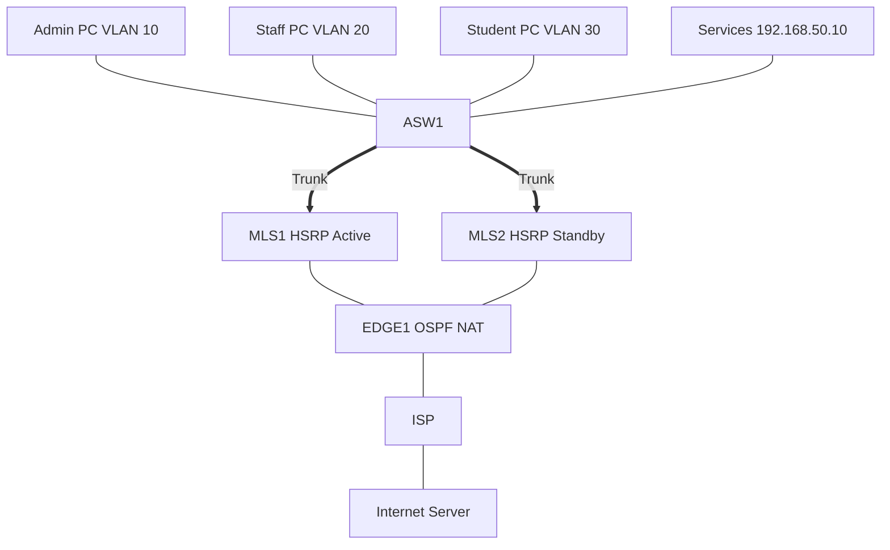

# 44 - Complete Enterprise Campus Configuration - Step by Step

> [!info] Outcome
> Integrate VLANs, trunks, Rapid Spanning Tree, Hot Standby Router Protocol, inter-VLAN routing, Open Shortest Path First, central DHCP relay, Domain Name System, Network Time Protocol, Syslog, Simple Network Management Protocol, Secure Shell, and Port Address Translation in one campus example.

> [!warning] Interface-name check
> The examples use Cisco 2911/1941 router interfaces such as `GigabitEthernet0/0` and Cisco 2960 switch ports such as `FastEthernet0/1`. Check the labels on your Packet Tracer device and substitute the actual interface name when it differs.

## 1. Packet Tracer Support

**Yes**

## 2. Example Topology



### Devices and Cabling

| From | To | Cable / Link |
|---|---|---|
| PC10/PC20/PC30 | ASW1 F0/1-3 | Copper straight-through access links |
| Services Server | ASW1 F0/10 | Copper straight-through VLAN 50 |
| ASW1 G0/1 | MLS1 G0/1 | 802.1Q trunk |
| ASW1 G0/2 | MLS2 G0/1 | 802.1Q trunk |
| MLS1 G0/2 | EDGE1 G0/0 | Layer 3 routed link |
| MLS2 G0/2 | EDGE1 G0/1 | Layer 3 routed link |
| EDGE1 G0/2 | ISP G0/0 | WAN routed link |
| ISP G0/1 | Internet Server | Copper straight-through |

## 3. Addressing Plan

| Device | Interface | Address / Setting | Default Gateway |
|---|---|---|---|
| VLAN 10 virtual | HSRP | 192.168.10.1 /24 | — |
| VLAN 20 virtual | HSRP | 192.168.20.1 /24 | — |
| VLAN 30 virtual | HSRP | 192.168.30.1 /24 | — |
| VLAN 50 virtual | HSRP | 192.168.50.1 /24 | — |
| VLAN 99 virtual | HSRP | 192.168.99.1 /24 | — |
| MLS1 | G0/2 | 10.0.1.1 /30 | — |
| EDGE1 | G0/0 | 10.0.1.2 /30 | — |
| MLS2 | G0/2 | 10.0.2.1 /30 | — |
| EDGE1 | G0/1 | 10.0.2.2 /30 | — |
| EDGE1 | G0/2 | 203.0.113.2 /30 | — |
| ISP | G0/0 | 203.0.113.1 /30 | — |
| Services Server | FastEthernet0 | 192.168.50.10 /24 | 192.168.50.1 |
| Internet Server | FastEthernet0 | 198.51.100.10 /24 | 198.51.100.1 |

## 4. Before You Configure

1. Place and rename every device exactly as shown.
2. Connect the interfaces in the cabling table.
3. Wait for links to become active before troubleshooting Layer 3.
4. Erase or inspect old lab configuration so it does not conflict with this example.

## 5. Step-by-Step Configuration

### Step 1 — Build the topology

Place the listed devices, rename them, and make each connection shown above.

### Step 2 — Confirm the addressing plan

Check that every address is unique, belongs to the stated subnet, and uses the correct mask or prefix length.

### Step 3 — Open each device

For IOS devices, select **CLI** and press Enter. For PCs and servers, use the named Packet Tracer desktop or services panel.

### Step 4 — Configure ASW1

Open **ASW1 → CLI**, press Enter, and enter the following commands exactly.

```cisco
enable
configure terminal
hostname ASW1
spanning-tree mode rapid-pvst
vlan 10
 name ADMINISTRATION
vlan 20
 name STAFF
vlan 30
 name STUDENTS
vlan 50
 name SERVERS
vlan 99
 name MANAGEMENT
interface fastEthernet0/1
 switchport mode access
 switchport access vlan 10
 spanning-tree portfast
 spanning-tree bpduguard enable
 switchport port-security
 switchport port-security mac-address sticky
interface fastEthernet0/2
 switchport mode access
 switchport access vlan 20
 spanning-tree portfast
 spanning-tree bpduguard enable
interface fastEthernet0/3
 switchport mode access
 switchport access vlan 30
 spanning-tree portfast
 spanning-tree bpduguard enable
interface fastEthernet0/10
 switchport mode access
 switchport access vlan 50
 spanning-tree portfast
interface range gigabitEthernet0/1-2
 switchport mode trunk
 switchport trunk native vlan 99
 switchport trunk allowed vlan 10,20,30,50,99
end
copy running-config startup-config
```
### Step 5 — Configure MLS1

Open **MLS1 → CLI**, press Enter, and enter the following commands exactly.

```cisco
enable
configure terminal
hostname MLS1
ip routing
spanning-tree mode rapid-pvst
vlan 10
vlan 20
vlan 30
vlan 50
vlan 99
interface gigabitEthernet0/1
 switchport mode trunk
 switchport trunk native vlan 99
 switchport trunk allowed vlan 10,20,30,50,99
interface gigabitEthernet0/2
 no switchport
 ip address 10.0.1.1 255.255.255.252
 no shutdown
interface vlan 10
 ip address 192.168.10.2 255.255.255.0
 standby 10 ip 192.168.10.1
 standby 10 priority 110
 standby 10 preempt
 ip helper-address 192.168.50.10
 no shutdown
interface vlan 20
 ip address 192.168.20.2 255.255.255.0
 standby 20 ip 192.168.20.1
 standby 20 priority 110
 standby 20 preempt
 ip helper-address 192.168.50.10
 no shutdown
interface vlan 30
 ip address 192.168.30.2 255.255.255.0
 standby 30 ip 192.168.30.1
 standby 30 priority 110
 standby 30 preempt
 ip helper-address 192.168.50.10
 no shutdown
interface vlan 50
 ip address 192.168.50.2 255.255.255.0
 standby 50 ip 192.168.50.1
 standby 50 priority 110
 standby 50 preempt
 no shutdown
interface vlan 99
 ip address 192.168.99.2 255.255.255.0
 standby 99 ip 192.168.99.1
 standby 99 priority 110
 standby 99 preempt
 no shutdown
spanning-tree vlan 10,20,30,50,99 root primary
router ospf 1
 router-id 1.1.1.1
 network 10.0.1.0 0.0.0.3 area 0
 network 192.168.10.0 0.0.0.255 area 0
 network 192.168.20.0 0.0.0.255 area 0
 network 192.168.30.0 0.0.0.255 area 0
 network 192.168.50.0 0.0.0.255 area 0
 network 192.168.99.0 0.0.0.255 area 0
 passive-interface default
 no passive-interface gigabitEthernet0/2
ntp server 192.168.50.10
logging host 192.168.50.10
snmp-server community CAMPUS-RO ro
username netadmin privilege 15 secret AdminSSH!23
ip domain-name campus.lab
crypto key generate rsa modulus 1024
ip ssh version 2
line vty 0 15
 login local
 transport input ssh
end
copy running-config startup-config
```
### Step 6 — Configure MLS2

Open **MLS2 → CLI**, press Enter, and enter the following commands exactly.

```cisco
enable
configure terminal
hostname MLS2
ip routing
spanning-tree mode rapid-pvst
vlan 10
vlan 20
vlan 30
vlan 50
vlan 99
interface gigabitEthernet0/1
 switchport mode trunk
 switchport trunk native vlan 99
 switchport trunk allowed vlan 10,20,30,50,99
interface gigabitEthernet0/2
 no switchport
 ip address 10.0.2.1 255.255.255.252
 no shutdown
interface vlan 10
 ip address 192.168.10.3 255.255.255.0
 standby 10 ip 192.168.10.1
 standby 10 priority 100
 standby 10 preempt
 ip helper-address 192.168.50.10
 no shutdown
interface vlan 20
 ip address 192.168.20.3 255.255.255.0
 standby 20 ip 192.168.20.1
 standby 20 priority 100
 standby 20 preempt
 ip helper-address 192.168.50.10
 no shutdown
interface vlan 30
 ip address 192.168.30.3 255.255.255.0
 standby 30 ip 192.168.30.1
 standby 30 priority 100
 standby 30 preempt
 ip helper-address 192.168.50.10
 no shutdown
interface vlan 50
 ip address 192.168.50.3 255.255.255.0
 standby 50 ip 192.168.50.1
 standby 50 priority 100
 standby 50 preempt
 no shutdown
interface vlan 99
 ip address 192.168.99.3 255.255.255.0
 standby 99 ip 192.168.99.1
 standby 99 priority 100
 standby 99 preempt
 no shutdown
spanning-tree vlan 10,20,30,50,99 root secondary
router ospf 1
 router-id 2.2.2.2
 network 10.0.2.0 0.0.0.3 area 0
 network 192.168.10.0 0.0.0.255 area 0
 network 192.168.20.0 0.0.0.255 area 0
 network 192.168.30.0 0.0.0.255 area 0
 network 192.168.50.0 0.0.0.255 area 0
 network 192.168.99.0 0.0.0.255 area 0
 passive-interface default
 no passive-interface gigabitEthernet0/2
ntp server 192.168.50.10
logging host 192.168.50.10
snmp-server community CAMPUS-RO ro
username netadmin privilege 15 secret AdminSSH!23
ip domain-name campus.lab
crypto key generate rsa modulus 1024
ip ssh version 2
line vty 0 15
 login local
 transport input ssh
end
copy running-config startup-config
```
### Step 7 — Configure EDGE1

Open **EDGE1 → CLI**, press Enter, and enter the following commands exactly.

```cisco
enable
configure terminal
hostname EDGE1
interface gigabitEthernet0/0
 ip address 10.0.1.2 255.255.255.252
 ip nat inside
 no shutdown
interface gigabitEthernet0/1
 ip address 10.0.2.2 255.255.255.252
 ip nat inside
 no shutdown
interface gigabitEthernet0/2
 ip address 203.0.113.2 255.255.255.252
 ip nat outside
 no shutdown
router ospf 1
 router-id 3.3.3.3
 network 10.0.1.0 0.0.0.3 area 0
 network 10.0.2.0 0.0.0.3 area 0
 default-information originate
exit
access-list 1 permit 192.168.0.0 0.0.255.255
ip nat inside source list 1 interface gigabitEthernet0/2 overload
ip route 0.0.0.0 0.0.0.0 203.0.113.1
username netadmin privilege 15 secret AdminSSH!23
ip domain-name campus.lab
crypto key generate rsa modulus 1024
ip ssh version 2
line vty 0 4
 login local
 transport input ssh
end
copy running-config startup-config
```
### Step 8 — Configure ISP

Open **ISP → CLI**, press Enter, and enter the following commands exactly.

```cisco
enable
configure terminal
hostname ISP
interface gigabitEthernet0/0
 ip address 203.0.113.1 255.255.255.252
 no shutdown
interface gigabitEthernet0/1
 ip address 198.51.100.1 255.255.255.0
 no shutdown
end
copy running-config startup-config
```

### Step 9 — Configure the Services Server

Set `192.168.50.10/24`, gateway `192.168.50.1`, DNS `192.168.50.10`. Create DHCP pools for VLAN10 (`192.168.10.100`, gateway `.1`), VLAN20, and VLAN30. Enable DNS A record `www.campus.lab` → `192.168.50.10`, HTTP, NTP, and Syslog services.
### Step 10 — Configure the Internet Server

Set `198.51.100.10/24`, gateway `198.51.100.1`, and enable HTTP.
### Step 11 — Configure user PCs

Select DHCP on each PC, confirm the correct VLAN lease, then work through the testing matrix in order.

## 6. Complete Device Configurations

Use these blocks when rebuilding the example from an empty Packet Tracer file. Each block belongs only to the device named above it.

### ASW1

```cisco
enable
configure terminal
hostname ASW1
spanning-tree mode rapid-pvst
vlan 10
 name ADMINISTRATION
vlan 20
 name STAFF
vlan 30
 name STUDENTS
vlan 50
 name SERVERS
vlan 99
 name MANAGEMENT
interface fastEthernet0/1
 switchport mode access
 switchport access vlan 10
 spanning-tree portfast
 spanning-tree bpduguard enable
 switchport port-security
 switchport port-security mac-address sticky
interface fastEthernet0/2
 switchport mode access
 switchport access vlan 20
 spanning-tree portfast
 spanning-tree bpduguard enable
interface fastEthernet0/3
 switchport mode access
 switchport access vlan 30
 spanning-tree portfast
 spanning-tree bpduguard enable
interface fastEthernet0/10
 switchport mode access
 switchport access vlan 50
 spanning-tree portfast
interface range gigabitEthernet0/1-2
 switchport mode trunk
 switchport trunk native vlan 99
 switchport trunk allowed vlan 10,20,30,50,99
end
copy running-config startup-config
```
### MLS1

```cisco
enable
configure terminal
hostname MLS1
ip routing
spanning-tree mode rapid-pvst
vlan 10
vlan 20
vlan 30
vlan 50
vlan 99
interface gigabitEthernet0/1
 switchport mode trunk
 switchport trunk native vlan 99
 switchport trunk allowed vlan 10,20,30,50,99
interface gigabitEthernet0/2
 no switchport
 ip address 10.0.1.1 255.255.255.252
 no shutdown
interface vlan 10
 ip address 192.168.10.2 255.255.255.0
 standby 10 ip 192.168.10.1
 standby 10 priority 110
 standby 10 preempt
 ip helper-address 192.168.50.10
 no shutdown
interface vlan 20
 ip address 192.168.20.2 255.255.255.0
 standby 20 ip 192.168.20.1
 standby 20 priority 110
 standby 20 preempt
 ip helper-address 192.168.50.10
 no shutdown
interface vlan 30
 ip address 192.168.30.2 255.255.255.0
 standby 30 ip 192.168.30.1
 standby 30 priority 110
 standby 30 preempt
 ip helper-address 192.168.50.10
 no shutdown
interface vlan 50
 ip address 192.168.50.2 255.255.255.0
 standby 50 ip 192.168.50.1
 standby 50 priority 110
 standby 50 preempt
 no shutdown
interface vlan 99
 ip address 192.168.99.2 255.255.255.0
 standby 99 ip 192.168.99.1
 standby 99 priority 110
 standby 99 preempt
 no shutdown
spanning-tree vlan 10,20,30,50,99 root primary
router ospf 1
 router-id 1.1.1.1
 network 10.0.1.0 0.0.0.3 area 0
 network 192.168.10.0 0.0.0.255 area 0
 network 192.168.20.0 0.0.0.255 area 0
 network 192.168.30.0 0.0.0.255 area 0
 network 192.168.50.0 0.0.0.255 area 0
 network 192.168.99.0 0.0.0.255 area 0
 passive-interface default
 no passive-interface gigabitEthernet0/2
ntp server 192.168.50.10
logging host 192.168.50.10
snmp-server community CAMPUS-RO ro
username netadmin privilege 15 secret AdminSSH!23
ip domain-name campus.lab
crypto key generate rsa modulus 1024
ip ssh version 2
line vty 0 15
 login local
 transport input ssh
end
copy running-config startup-config
```
### MLS2

```cisco
enable
configure terminal
hostname MLS2
ip routing
spanning-tree mode rapid-pvst
vlan 10
vlan 20
vlan 30
vlan 50
vlan 99
interface gigabitEthernet0/1
 switchport mode trunk
 switchport trunk native vlan 99
 switchport trunk allowed vlan 10,20,30,50,99
interface gigabitEthernet0/2
 no switchport
 ip address 10.0.2.1 255.255.255.252
 no shutdown
interface vlan 10
 ip address 192.168.10.3 255.255.255.0
 standby 10 ip 192.168.10.1
 standby 10 priority 100
 standby 10 preempt
 ip helper-address 192.168.50.10
 no shutdown
interface vlan 20
 ip address 192.168.20.3 255.255.255.0
 standby 20 ip 192.168.20.1
 standby 20 priority 100
 standby 20 preempt
 ip helper-address 192.168.50.10
 no shutdown
interface vlan 30
 ip address 192.168.30.3 255.255.255.0
 standby 30 ip 192.168.30.1
 standby 30 priority 100
 standby 30 preempt
 ip helper-address 192.168.50.10
 no shutdown
interface vlan 50
 ip address 192.168.50.3 255.255.255.0
 standby 50 ip 192.168.50.1
 standby 50 priority 100
 standby 50 preempt
 no shutdown
interface vlan 99
 ip address 192.168.99.3 255.255.255.0
 standby 99 ip 192.168.99.1
 standby 99 priority 100
 standby 99 preempt
 no shutdown
spanning-tree vlan 10,20,30,50,99 root secondary
router ospf 1
 router-id 2.2.2.2
 network 10.0.2.0 0.0.0.3 area 0
 network 192.168.10.0 0.0.0.255 area 0
 network 192.168.20.0 0.0.0.255 area 0
 network 192.168.30.0 0.0.0.255 area 0
 network 192.168.50.0 0.0.0.255 area 0
 network 192.168.99.0 0.0.0.255 area 0
 passive-interface default
 no passive-interface gigabitEthernet0/2
ntp server 192.168.50.10
logging host 192.168.50.10
snmp-server community CAMPUS-RO ro
username netadmin privilege 15 secret AdminSSH!23
ip domain-name campus.lab
crypto key generate rsa modulus 1024
ip ssh version 2
line vty 0 15
 login local
 transport input ssh
end
copy running-config startup-config
```
### EDGE1

```cisco
enable
configure terminal
hostname EDGE1
interface gigabitEthernet0/0
 ip address 10.0.1.2 255.255.255.252
 ip nat inside
 no shutdown
interface gigabitEthernet0/1
 ip address 10.0.2.2 255.255.255.252
 ip nat inside
 no shutdown
interface gigabitEthernet0/2
 ip address 203.0.113.2 255.255.255.252
 ip nat outside
 no shutdown
router ospf 1
 router-id 3.3.3.3
 network 10.0.1.0 0.0.0.3 area 0
 network 10.0.2.0 0.0.0.3 area 0
 default-information originate
exit
access-list 1 permit 192.168.0.0 0.0.255.255
ip nat inside source list 1 interface gigabitEthernet0/2 overload
ip route 0.0.0.0 0.0.0.0 203.0.113.1
username netadmin privilege 15 secret AdminSSH!23
ip domain-name campus.lab
crypto key generate rsa modulus 1024
ip ssh version 2
line vty 0 4
 login local
 transport input ssh
end
copy running-config startup-config
```
### ISP

```cisco
enable
configure terminal
hostname ISP
interface gigabitEthernet0/0
 ip address 203.0.113.1 255.255.255.252
 no shutdown
interface gigabitEthernet0/1
 ip address 198.51.100.1 255.255.255.0
 no shutdown
end
copy running-config startup-config
```

## 7. Key Configuration Logic

- Configure physical or logical interfaces before depending on a protocol that uses them.
- Use `no shutdown` on routed interfaces and switched virtual interfaces when required.
- Keep VLAN IDs, IP networks, masks, wildcard masks, and default gateways consistent with the addressing table.
- Save the configuration only after verification succeeds.

> [!note] Teaching note
> The integrated configuration deliberately uses local SSH and SNMPv2c for Packet Tracer compatibility. Upgrade to central AAA and SNMPv3 in a production design.

## 8. Verification Commands

Run the commands relevant to the device and compare the result with the addressing and topology tables.

- `show interfaces trunk`
- `show spanning-tree root`
- `show standby brief`
- `show ip ospf neighbor`
- `show ip route`
- `show ip dhcp binding`
- `show ip nat translations`
- `show ntp associations`
- `show logging`

## 9. Testing Matrix

| Test | Source | Destination / Check | Expected Result |
|---|---|---|---|
| DHCP | Each user PC | Services Server | Receives address from its own VLAN pool |
| Gateway | Each user PC | Local HSRP .1 | Success |
| Inter-VLAN | Admin PC | Staff and Student PCs | Success unless later restricted by policy |
| DNS | Any PC | www.campus.lab | Resolves to 192.168.50.10 |
| Internet | Any PC | 198.51.100.10 | Success through PAT |
| Failover | Admin PC continuous ping | Shut MLS1 trunk/uplink | Brief loss, then service through MLS2 |

## 10. Troubleshooting

| Symptom | Likely Cause | Check or Fix |
|---|---|---|
| Clients receive no DHCP | Pool, helper, trunk, VLAN, or server gateway mismatch | Trace from access VLAN to SVI to 192.168.50.10 |
| OSPF neighbors absent | Routed port, address, passive interface, or area issue | Verify G0/2 on each core and both EDGE links |
| Internet fails but campus works | Default route, default advertisement, NAT role, or ACL issue | Verify EDGE default route and NAT translations |
| HSRP failover fails | Layer 2 path or group mismatch | Compare virtual IP, group, VLAN, and trunk state |

## 11. Save and Finish

On every IOS device whose tests pass:

```cisco
copy running-config startup-config
```

Then save the Packet Tracer activity file with a descriptive version number.

## 12. Related Configuration Notes

- [[Configuration Library Dashboard]]

Return to [[Configuration Library Dashboard]].
