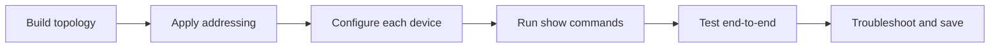

# Configuration Library Dashboard

This folder is the dedicated hands-on configuration library. The original teaching notes and their code remain unchanged.

> [!tip] Recommended use
> Open one configuration guide, build its topology from an empty Packet Tracer file, enter each device block, verify the result, and then introduce one fault for troubleshooting practice.

## Naming Standard

Protocol notes use the short name and full name together, such as **OSPF — Open Shortest Path First** and **NTP — Network Time Protocol**.

## 01 — Device Foundations

Open [[Device Foundations Configuration Guide]] for 4 complete walkthroughs.
## 02 — Switching and Inter-VLAN Routing

Open [[Switching and Inter-VLAN Routing Configuration Guide]] for 9 complete walkthroughs.
## 03 — Routing Protocols

Open [[Routing Protocols Configuration Guide]] for 5 complete walkthroughs.
## 04 — Network Services

Open [[Network Services Configuration Guide]] for 6 complete walkthroughs.
## 05 — Security

Open [[Security Configuration Guide]] for 7 complete walkthroughs.
## 06 — High Availability

Open [[High Availability Configuration Guide]] for 3 complete walkthroughs.
## 07 — Monitoring and Management

Open [[Monitoring and Management Configuration Guide]] for 4 complete walkthroughs.
## 08 — WAN, VPN, and Wireless

Open [[WAN, VPN, and Wireless Configuration Guide]] for 4 complete walkthroughs.
## 09 — Internet Protocol Version 6 (IPv6)

Open [[Internet Protocol Version 6 (IPv6) Configuration Guide]] for 3 complete walkthroughs.
## 10 — Integrated Enterprise Configuration

Open [[Integrated Enterprise Configuration Guide]] for 1 complete walkthroughs.

## Configuration Workflow

## Completion Checklist

- [ ] Topology matches the guide
- [ ] Interfaces and cables are correct
- [ ] Addressing table is complete
- [ ] Every device configuration is entered
- [ ] Verification output is checked
- [ ] Testing matrix passes
- [ ] Running configurations are saved
