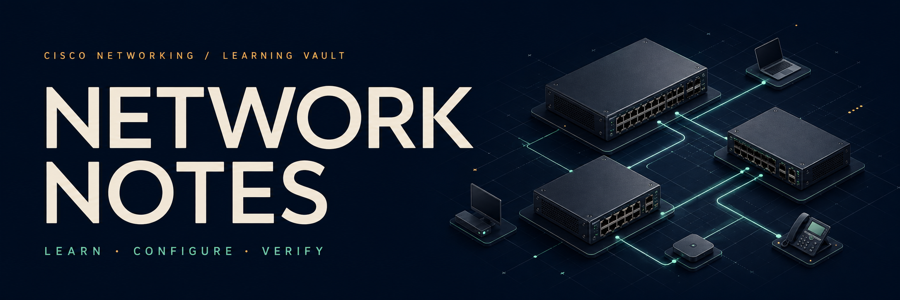
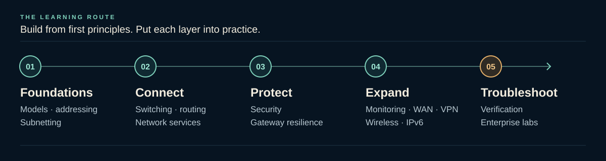

<div align="center">

# Network Notes

**Understand the network. Build it. Prove it works.**

A Cisco networking learning and teaching vault.<br>
Theory, guided configurations, practical labs, and classroom resources — connected in Markdown and Obsidian.

<p>
  <a href="#start-here">Start here</a> ·
  <a href="#learning-path">Learning path</a> ·
  <a href="#explore-the-vault">Explore the vault</a> ·
  <a href="#featured-practicals">Practicals</a> ·
  <a href="#open-in-obsidian">Open in Obsidian</a>
</p>

</div>

| **379** | **30** | **46** | **3** |
| :---: | :---: | :---: | :---: |
| Learning notes | Numbered practice labs | Configuration walkthroughs | Packet Tracer practicals |

## Start here

Choose an entry point, then follow the connected dashboards at your own pace.

<table>
  <tr>
    <th align="left">For students</th>
    <th align="left">For lecturers</th>
    <th align="left">For lab users</th>
  </tr>
  <tr>
    <td valign="top">Build a foundation, follow the roadmap, and turn each topic into practice.<br><br><a href="00%20-%20Start%20Here/Student%20Dashboard.md"><strong>Student dashboard →</strong></a><br><a href="00%20-%20Start%20Here/Networking%20Learning%20Roadmap.md">Follow the study roadmap</a></td>
    <td valign="top">Plan lessons with teaching templates, cheat sheets, viva questions, and assessments.<br><br><a href="00%20-%20Start%20Here/Lecturer%20Dashboard.md"><strong>Lecturer dashboard →</strong></a><br><a href="03%20-%20Teaching%20Toolkit/Teaching%20Toolkit%20Dashboard.md">Browse the teaching toolkit</a></td>
    <td valign="top">Choose a topology, configure the devices, and verify the result.<br><br><a href="02%20-%20Practice%20Labs/Lab%20Dashboard.md"><strong>Lab dashboard →</strong></a><br><a href="05%20-%20Step-by-Step%20Configurations/Configuration%20Library%20Dashboard.md">Browse configuration guides</a></td>
  </tr>
</table>

Looking for a specific topic? Use the [Network Protocol Master Index](00%20-%20Start%20Here/Network%20Protocol%20Master%20Index.md), or open the [main Networking Dashboard](00%20-%20Start%20Here/Networking%20Dashboard.md) for the complete overview.

## Learning path

Move from the fundamentals to a working network, then test how it behaves when something goes wrong.



<details>
<summary><strong>View the complete study sequence</strong></summary>

1. **Foundations** — network fundamentals and models.
2. **Addressing** — IPv4, subnetting, CIDR, and VLSM.
3. **Switching** — Ethernet, VLANs, trunks, STP, and EtherChannel.
4. **Routing** — static routes, RIP, OSPF, and EIGRP.
5. **Services** — DHCP, DNS, NTP, file transfer, web, and email.
6. **Security and translation** — SSH, AAA, ACLs, Layer 2 security, NAT, and PAT.
7. **Resilience** — HSRP, VRRP, GLBP, and resilient design.
8. **Visibility** — SNMP, Syslog, CDP, LLDP, and monitoring.
9. **Wider networks** — WAN technologies, VPNs, wireless, and IPv6.
10. **Integration** — troubleshooting and enterprise projects.

Follow the [Networking Learning Roadmap](00%20-%20Start%20Here/Networking%20Learning%20Roadmap.md) for the detailed route through the vault.

</details>

## Explore the vault

The repository folder is also the **Obsidian vault root**. All six numbered areas are directly accessible here and on GitHub.

| Area | What you will find |
| :--- | :--- |
| [**00 · Start Here**](00%20-%20Start%20Here/) | Dashboards, indexes, and learning roadmaps. |
| [**01 · Learn**](01%20-%20Learn/) | Topic explanations from network fundamentals to IPv6 and troubleshooting. |
| [**02 · Practice Labs**](02%20-%20Practice%20Labs/) | 30 numbered exercises for building, configuring, and testing networks. |
| [**03 · Teaching Toolkit**](03%20-%20Teaching%20Toolkit/) | Lesson resources, templates, cheat sheets, viva questions, and assessments. |
| [**04 · Advanced Projects**](04%20-%20Advanced%20Projects/) | Enterprise and platform-level projects; start with the [project dashboard](04%20-%20Advanced%20Projects/Advanced%20Projects%20Dashboard.md). |
| [**05 · Step-by-Step Configurations**](05%20-%20Step-by-Step%20Configurations/) | 46 numbered Cisco walkthroughs and 10 category guides. |

Supporting material lives in [Images and Source](Images%20and%20Source/). Ready-to-open topologies and their guides live in [Practical with Sample Code and Configs](Practical%20with%20Sample%20Code%20and%20Configs/).

## Featured practicals

Three focused Packet Tracer networks, each with a guide and a saved topology.

| Practical | Build and verify | Open |
| :--- | :--- | :--- |
| **HSRP Gateway Redundancy** | Three-router high availability: Layer 2 cabling, virtual gateways, priorities, preemption, interface tracking, floating static routes, and failover. | [Guide](Practical%20with%20Sample%20Code%20and%20Configs/HSRP%20Gateway%20Redundancy%20Lab/HSRP%20Gateway%20Redundancy%20Lab%20-%20Configuration%20Guide.md) · [Files](Practical%20with%20Sample%20Code%20and%20Configs/HSRP%20Gateway%20Redundancy%20Lab/) |
| **Three-Router OSPF** | Neighbor formation, route advertisement, passive interfaces, verification, and troubleshooting. | [Guide](Practical%20with%20Sample%20Code%20and%20Configs/Three-Router%20OSPF%20Lab/Cisco%20Packet%20Tracer%20%E2%80%93%20Three-Router%20OSPF%20Lab.md) · [Files](Practical%20with%20Sample%20Code%20and%20Configs/Three-Router%20OSPF%20Lab/) |
| **Three-Router Static Routing** | Three LANs, routed interfaces, /30 transit networks, static routes, PC gateways, end-to-end tests, and traceroute. | [Guide](Practical%20with%20Sample%20Code%20and%20Configs/Three-Router%20Static%20Routing%20Lab/Cisco%20Packet%20Tracer%20%E2%80%93%20Three-Router%20Static%20Routing%20Lab.md) · [Files](Practical%20with%20Sample%20Code%20and%20Configs/Three-Router%20Static%20Routing%20Lab/) |

Download or clone the repository and open the `.pkt` files with **Cisco Packet Tracer**. These binary topology files cannot be previewed meaningfully on GitHub.

## Open in Obsidian

Obsidian brings the dashboards, wikilinks, callouts, tags, and frontmatter together. Every learning note is also a normal Markdown file you can read independently.

```bash
git clone https://github.com/UdayaSri0/Network-Notes.git
cd Network-Notes
```

1. Clone the repository, or download and extract its ZIP archive.
2. In Obsidian, select **Open folder as vault**.
3. Choose **the repository folder itself**: `Network-Notes` (or `Network Notes` locally). It contains `.obsidian` and `00 - Start Here` directly.
4. Open `00 - Start Here/Networking Dashboard.md`.

**Updating an existing vault?** If you previously opened the nested `Networking` folder, reopen the repository root. The notes, attachments, and settings moved together, so existing note links retain their targets.

**Browsing on GitHub?** The standard links in this README work there. Obsidian `[[wikilinks]]` inside the notes are not rendered as navigable links by GitHub; open the vault in Obsidian for connected navigation.

## Work through a lab

**Read → Plan → Configure → Verify → Test failure → Save.**

<details>
<summary><strong>Lab workflow and useful verification commands</strong></summary>

1. Read the objective and topology requirements.
2. Build or open the topology in Cisco Packet Tracer.
3. Complete the addressing table before entering commands.
4. Configure interfaces and use `no shutdown` where required.
5. Configure switching, routing, services, or security in the order shown.
6. Verify each stage before moving to the next.
7. Test the expected success path.
8. Perform the documented failure or troubleshooting tests.
9. Save the device configurations and Packet Tracer file.

```cisco
show ip interface brief
show interfaces status
show vlan brief
show ip route
show running-config
ping <destination>
traceroute <destination>
```

Choose commands that match the technology being practised. Individual guides include further checks; a successful ping alone does not prove redundancy, security, or failure recovery.

</details>

## Contributing

Improvements to technical accuracy, clarity, lab coverage, and navigation are welcome. Major notes aim to explain **what, why, where, and how**, followed by configuration, verification, failure cases, and troubleshooting.

<details>
<summary><strong>Content conventions and contribution checklist</strong></summary>

- Use a clear, unique, descriptive filename in the most relevant section.
- Follow the existing YAML frontmatter style and connect related topics with Obsidian wikilinks.
- Include configuration, verification, failure cases, and troubleshooting where applicable. Test Cisco IOS commands in an appropriate lab environment.
- Keep images and Packet Tracer files near the practical that uses them; place shared media in `Images and Source`.
- Do not commit passwords, private addresses from real environments, API keys, or other sensitive information.
- Before submitting, check links, code fences, readable filenames, and internally consistent lab addressing.

</details>

<details>
<summary><strong>Vault settings and maintenance</strong></summary>

The root `.obsidian/` folder holds the vault configuration. Learning notes use YAML frontmatter for classification and search, plus unique note names for connected navigation.

The historical scripts in `.vault-tools/` still reference the older `Newroking` layout. Review their paths before use; they are not required to browse the notes or open the vault. The former `Networking/` wrapper is no longer the vault root.

</details>

<details>
<summary><strong>Technical notes, project status, and license</strong></summary>

**Lab use.** Configurations are intended for education and lab use. Validate them before using them on production equipment. Cisco IOS commands and supported features vary by device model, image, license, and software version. Some examples preserve addressing from original teaching diagrams; replace it with an approved private or assigned address plan in real networks.

**Project status.** This is an actively developed learning vault. Content, navigation, and practical files may expand as new topics and labs are added.

**License.** No license file is currently included. Unless a license is added, obtain permission from the repository owner before copying, redistributing, or republishing the project outside the permissions automatically provided by GitHub.

</details>
